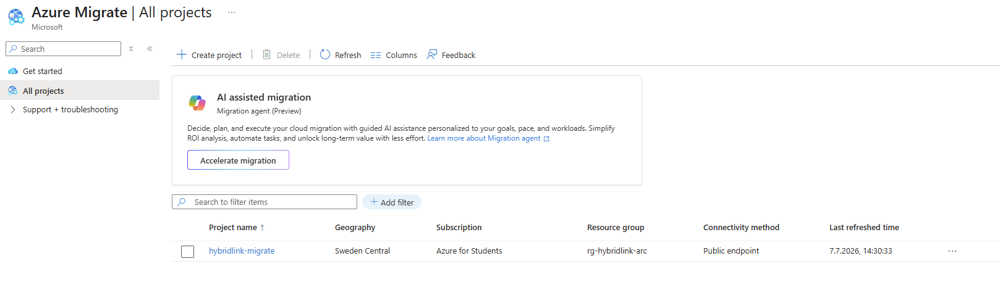
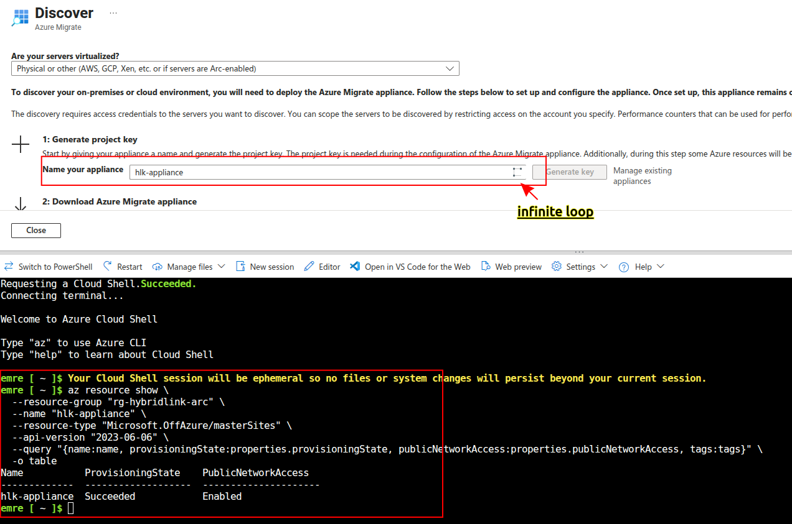

# 🔗 Hybrid Cloud: On-Prem Server zu Azure Arc, Backup & Migrate


---

> **[Deutsch](#deutsch)** &nbsp;·&nbsp; **[English](#english)**

---

<br>
<br>

# Deutsch

<a name="deutsch"></a>

Hands-on Hybrid-Cloud-Projekt: Eine on-premises Windows-Server-2025-VM wird vorbereitet und anschließend an Microsoft Azure angebunden — über **Azure Arc**, **Azure Backup** und **Azure Migrate** — für das fiktive Unternehmen **HybridLink GmbH**.

Dieses Projekt basiert auf einer offiziellen Lab-Setup-Anleitung (Basis-Server-Vorbereitung) und erweitert diese um eine vollständige Hybrid-Cloud-Integration mit Azure.

> 📄 **Original-Dokument:** [Lab-Setup_Hybrid-Cloud-Basis.pdf](docs/Lab-Setup_Hybrid-Cloud-Basis.pdf)

---

## 📋 Inhaltsverzeichnis

| | Aufgabe | Thema | Quelle | Status |
|--|---------|-------|--------|--------|
| 📄 | [Teil 1 — Basis-Server-Vorbereitung](#teil-1--basis-server-vorbereitung) | VMware VM, Windows Server 2025, Netzwerk | Lab-Dokument | ✅ |
| 📄 | [Bonus 1 — Domain Controller](#bonus-1--domain-controller) | AD DS, Domänen-Promotion, Testbenutzer | Lab-Dokument (Bonus) | ✅ |
| 🔵 | [Bonus 2.1 — Resource Group](#bonus-21--resource-group) | Projekt-Grundlage in Azure | Eigene Erweiterung | ✅ |
| 🔵 | [Bonus 2.2 — Azure Arc Onboarding](#bonus-22--azure-arc-onboarding) | Server-Registrierung bei Azure | Eigene Erweiterung | ✅ |
| 🔵 | [Bonus 2.3 — Policy, Monitor & Defender](#bonus-23--policy-monitor--defender) | Governance & Sicherheit | Eigene Erweiterung | ✅ |
| 🔵 | [Bonus 2.4 — Azure Backup (MARS Agent)](#bonus-24--azure-backup-mars-agent) | On-Prem-Backup in die Cloud | Eigene Erweiterung | ✅ |
| 🔵 | [Bonus 2.5 — Azure Migrate](#bonus-25--azure-migrate) | Migrationsbewertung | Eigene Erweiterung | ⚠️ |

> ℹ️ **Hinweis zur Struktur:** *Teil 1* und *Bonus 1* stammen direkt aus der offiziellen Lab-Setup-Anleitung. *Bonus 2* (Azure-Hybrid-Integration) ist **nicht** Teil des Original-Dokuments, sondern eine eigenständige Erweiterung, um den vollen Hybrid-Cloud-Lebenszyklus abzubilden.

---

## 🏗️ Infrastrukturübersicht

| Ressource | Name | Konfiguration |
|-----------|------|----------------|
| Hypervisor | VMware Workstation Pro | Kostenlos für private Nutzung |
| Virtual Machine | `SRV-HYBRID01` | Windows Server 2025 Standard Evaluation, 2 vCPU, 4 GB RAM, 60 GB Disk |
| Netzwerk | NAT (VMnet8) | `192.168.35.10/24` · Gateway `192.168.35.2` · DNS `8.8.8.8` → später `192.168.35.10` |
| Resource Group | `rg-hybridlink-arc` | Sweden Central |
| Azure Arc | `SRV-HYBRID01` | Connected Machine Agent, Public Endpoint |
| Recovery Services Vault | `rsv-hybridlink-backup` | Sweden Central · LRS |
| Azure Migrate Projekt | `hybridlink-migrate` | Geography: Sweden |
| Active Directory | `hybridlink.local` | Forest/Domain, NetBIOS `HYBRIDLINK` |

---

## Teil 1 — Basis-Server-Vorbereitung

> 💡 Bevor ein Server an Azure Arc, Backup oder Migrate angebunden werden kann, braucht es eine funktionierende, netzwerkfähige on-premises VM als Ausgangsbasis.

### Durchgeführte Schritte (laut Lab-Dokument)

- Windows Server 2025 Evaluation ISO heruntergeladen
- VM `SRV-HYBRID01` in VMware erstellt (2 vCPU, 4 GB RAM, 60 GB Disk, NAT)
- Windows Server 2025 Standard Evaluation (Desktop Experience) installiert — via Easy Install
- Computername auf `SRV-HYBRID01` gesetzt
- Statische IP konfiguriert
- VMware Tools installiert
- Snapshot **"Basis fertig"** erstellt

> 🔑 **Erkenntnis 1 — VMware NAT-Subnetz weicht vom Dokument ab:** Das Lab-Dokument ging von `192.168.100.0/24` aus, VMware Workstation hatte auf diesem Host jedoch automatisch `192.168.35.0/24` als NAT-Subnetz (VMnet8) vergeben. Anstatt die VMware-Netzwerkkonfiguration zu ändern (Risiko für andere VMs auf dem Host), wurde die VM-IP an das tatsächliche Subnetz angepasst — ein realistisches Beispiel dafür, dass Netzwerkpläne in der Praxis oft von der Dokumentation abweichen.

> 🔑 **Erkenntnis 2 — VMware Player unterstützt keine Snapshots:** Die Snapshot-Funktion ist in VMware Workstation **Player** nicht verfügbar. Da Broadcom Workstation **Pro** seit November 2024 kostenlos für private Nutzung anbietet, wurde ein Upgrade auf Pro durchgeführt — VM-Dateien sind zwischen Player und Pro vollständig kompatibel, ein Neuaufsetzen war nicht nötig.

| | |
|--|--|
|  |  |
| *Netzwerkkonfiguration verifiziert — 192.168.35.10, Internetzugang bestätigt* | *Snapshot "Basis fertig" erfolgreich erstellt* |

---

## Bonus 1 — Domain Controller

> 💡 Das Lab-Dokument enthält einen optionalen Bonus-Teil zur Vorbereitung von Microsoft Entra Connect Cloud Sync: Der Server wird zu einem Active Directory Domain Controller heraufgestuft.

### Durchgeführte Schritte

- AD DS-Rolle installiert
- Server zu Domain Controller heraufgestuft — neue Gesamtstruktur `hybridlink.local`
- DNS-Client auf sich selbst umgestellt (`192.168.35.10`, Fallback `8.8.8.8`)
- Organisationseinheit `HybridLink-Users` und Testbenutzer `Anna Test` (`a.test`) angelegt
- Finaler Snapshot **"DC fertig – bereit für Entra Connect"** erstellt

> 🔑 **Erkenntnis 3 — Leeres Administrator-Passwort blockiert Domain-Promotion:** Durch die automatische Anmeldung (Auto-Logon) aus dem Easy-Install-Prozess blieb das lokale Administrator-Passwort leer. Active Directory verweigerte die Domain-Promotion, da dieses Konto automatisch zum Domain-Administrator wird und damit den Passwort-Richtlinien entsprechen muss. Lösung: `net user Administrator "<StrongPassword>" /passwordreq:yes` vor der Promotion ausführen.

```powershell
# Fix: Set a strong password for the local Administrator account
# before promoting the server to a Domain Controller
net user Administrator "Pa$$w0rd2026!Lab" /passwordreq:yes
```

| | |
|--|--|
|  |  |
| *AD DS-Rolle installiert* | *Domain Controller erfolgreich heraufgestuft — hybridlink.local* |
|  |  |
| *DNS zeigt erfolgreich auf sich selbst* | *Testbenutzer Anna Test in OU HybridLink-Users angelegt* |
|  | |
| *Finaler Snapshot "DC fertig – bereit für Entra Connect"* | |

---

## Bonus 2.1 — Resource Group

> 💡 Eine Resource Group ist der logische Container für alle Azure-Ressourcen dieses Projekts — getrennt von anderen Portfolio-Projekten für saubere Kostenverfolgung und Dokumentation.

### Ressource erstellt

- **rg-hybridlink-arc** — Sweden Central
- Tags: `Environment=Lab`, `Project=hybridlink-arc`, `Owner=Emre`
- Custom Policy **"Require a tag on resources"** (Tag `Environment`) zugewiesen — Deny-Effekt

```bash
az group create \
  --name rg-hybridlink-arc \
  --location swedencentral \
  --tags Environment=Lab Project=hybridlink-arc Owner=Emre
```

> 🔑 **Erkenntnis 4 — Tag-Policy mit Deny-Effekt betrifft jede Sub-Ressource:** Eine "Require a tag"-Policy auf Resource-Group-Ebene blockiert **jede neu erstellte Ressource** in dieser Gruppe — inklusive Sub-Ressourcen wie Arc-Extensions und Migrate-Projekten, die über Portal-Assistenten oft **keinen** Tags-Tab anbieten. Das erzwingt in solchen Fällen den Wechsel auf die Azure CLI.


*rg-hybridlink-arc erfolgreich erstellt — Sweden Central*

---

## Bonus 2.2 — Azure Arc Onboarding

> 💡 Azure Arc erweitert die Azure-Kontrollebene auf on-premises Server — der Server erscheint als verwaltbare Ressource in Azure, ohne migriert zu werden.

### Durchgeführte Schritte

- Onboarding-Skript über Azure Portal generiert (Public Endpoint, manuelle Authentifizierung)
- Skript auf `SRV-HYBRID01` als Administrator ausgeführt
- Interaktive Browser-Authentifizierung durchgeführt
- Server erfolgreich als **Connected** registriert

```powershell
# Allow the onboarding script to run for this session only (no permanent policy change)
Set-ExecutionPolicy -ExecutionPolicy Bypass -Scope Process -Force
.\OnboardingScript.ps1
```

> 🔑 **Erkenntnis 5 — Die "Servers"-Ansicht ist nicht direkt im linken Menü:** Im aktuellen Azure-Arc-Portal-Design befindet sich der Einstiegspunkt für einzelne Server unter **Overview → "Machines"**-Kachel, nicht als eigener Menüpunkt in der linken Navigationsleiste.

| | |
|--|--|
|  | |
| *SRV-HYBRID01 erfolgreich mit Azure Arc verbunden* | |

---

## Bonus 2.3 — Policy, Monitor & Defender

> 💡 Sobald ein Server über Arc verwaltet wird, können dieselben Governance- und Sicherheitswerkzeuge angewendet werden wie bei nativen Azure-VMs.

### Durchgeführte Schritte

- Policy-Compliance verifiziert — `rg-hybridlink-arc` zu 100 % konform mit Tag-Policy
- Azure Monitor Agent (AMA) als Arc-Extension installiert
- Microsoft Defender for Cloud (Foundational CSPM, kostenlose Stufe) aktiviert

```bash
# Install Azure Monitor Agent extension on the Arc-connected server
az connectedmachine extension create \
  --name AzureMonitorWindowsAgent \
  --publisher Microsoft.Azure.Monitor \
  --type AzureMonitorWindowsAgent \
  --machine-name "SRV-HYBRID01" \
  --resource-group "rg-hybridlink-arc" \
  --location "swedencentral" \
  --tags Environment=Lab Project=hybridlink-arc Owner=Emre
```

> 🔑 **Erkenntnis 6 — Beschädigter Download-Cache blockiert Extension-Installation:** Ein fehlgeschlagener erster Versuch (Policy-Deny) hinterließ einen unvollständigen Extension-Download im lokalen Cache (`boost::filesystem::copy_file: The file exists`). Lösung: betroffene Dienste stoppen, `GuestConfig\downloads`-Cache leeren, Dienste neu starten, Extension erneut anfordern.

> 🔑 **Erkenntnis 7 — Defender-Sync-Verzögerung:** Neu Arc-registrierte Server erscheinen nicht sofort im Defender-for-Cloud-Inventar — bekannte Synchronisationsverzögerung (teils mehrere Stunden), die auch mit `az policy state trigger-scan` nur bedingt beschleunigt werden kann.

| | |
|--|--|
|  |  |
| *Tag-Policy — 100 % konform* | *Azure Monitor Agent erfolgreich installiert* |

---

## Bonus 2.4 — Azure Backup (MARS Agent)

> 💡 On-premises Server können nicht wie native Azure-VMs direkt durch Azure gesichert werden — stattdessen sammelt ein lokaler Agent (MARS) Dateien und überträgt sie in den Cloud-Tresor.

### Durchgeführte Schritte

- Recovery Services Vault `rsv-hybridlink-backup` erstellt, Storage Replication auf **LRS** gesetzt
- MARS Agent (Microsoft Azure Recovery Services Agent) auf `SRV-HYBRID01` installiert und registriert
- Verschlüsselungs-Passphrase generiert und sicher auf dem Host-PC gespeichert (nicht im Repository!)
- Backup-Zeitplan konfiguriert: **täglich**, Retention auf **7 Tage** reduziert (Weekly/Monthly/Yearly deaktiviert)
- Testordner `BackupTest` gesichert, erster manueller Backup-Job erfolgreich abgeschlossen

```bash
az backup vault create \
  --resource-group "rg-hybridlink-arc" \
  --name "rsv-hybridlink-backup" \
  --location "swedencentral" \
  --tags Environment=Lab Project=hybridlink-arc Owner=Emre
```

> 🔑 **Erkenntnis 8 — MARS Agent ≠ VM-Snapshot-Backup:** Im Gegensatz zum VM-Backup (Enhanced Policy, siehe DataSafe-Projekt) sichert der MARS Agent auf **Datei-/Ordnerebene** — er läuft als Dienst innerhalb des Gastbetriebssystems, nicht als Hypervisor-Snapshot. Das ist die einzige Möglichkeit, on-premises Server ohne native Azure-VM-Anbindung zu schützen.

> 🔑 **Erkenntnis 9 — Standard-Retention-Policy ist für Lab-Umgebungen überdimensioniert:** Die Vorgabe (180 Tage täglich + bis zu 10 Jahre wöchentlich/monatlich/jährlich) ist für produktive Compliance-Anforderungen gedacht. Für Lab-Zwecke wurde auf 7 Tage täglich reduziert, um Speicherkosten zu minimieren.

| | |
|--|--|
|  |  |
| *Recovery Services Vault erstellt — LRS* | *MARS Agent erfolgreich registriert* |
|  |  |
| *Backup-Zeitplan konfiguriert* | *Erster Backup-Job erfolgreich abgeschlossen* |

---

## Bonus 2.5 — Azure Migrate

> 💡 Azure Migrate bewertet on-premises Server für eine mögliche Cloud-Migration — inklusive Sizing-Empfehlungen für Ziel-VMs in Azure.

### Durchgeführte Schritte

- Migrate-Projekt `hybridlink-migrate` via Azure CLI erstellt (Geography: Sweden)
- On-Prem-VM per USB-Transfer auf einen zweiten Host (Mini-PC, Linux, VMware Workstation Pro, 32 GB RAM) verschoben, um die Ressourcenanforderungen der Appliance (16 GB RAM, 8 vCPU) erfüllen zu können
- `Microsoft.OffAzure/masterSites`-Ressource (`hlk-appliance`) via Azure CLI erfolgreich erstellt
- Appliance-Key-Generierung im Azure Portal **dauerhaft blockiert** (siehe unten) — Discovery-Phase konnte nicht durchgeführt werden

```bash
# Direct ARM resource creation was required due to CLI extension
# and API-version issues encountered during this step
az resource create \
  --resource-group "rg-hybridlink-arc" \
  --name "hybridlink-migrate" \
  --resource-type "Microsoft.Migrate/migrateProjects" \
  --api-version "2020-06-01-preview" \
  --is-full-object \
  --properties '{
    "location": "swedencentral",
    "tags": {
      "Environment": "Lab",
      "Project": "hybridlink-arc",
      "Owner": "Emre"
    },
    "properties": {}
  }'

# The masterSites resource (backing the appliance key generation)
# also required a stable, non-preview API version to succeed
az resource create \
  --resource-group "rg-hybridlink-arc" \
  --name "hlk-appliance" \
  --resource-type "Microsoft.OffAzure/masterSites" \
  --api-version "2023-06-06" \
  --is-full-object \
  --properties '{
    "location": "swedencentral",
    "tags": {
      "Environment": "Lab",
      "Project": "hybridlink-arc",
      "Owner": "Emre"
    },
    "properties": {
      "allowMultipleSites": false,
      "publicNetworkAccess": "Enabled"
    }
  }'
```

### ⚠️ Root-Cause-Analyse — Appliance-Key-Generierung dauerhaft blockiert

Trotz erfolgreicher Erstellung aller identifizierbaren Voraussetzungen blieb der Portal-Button **"Generate key"** in einer Endlosschleife hängen, ohne einen sichtbaren Fehler auszugeben. Es wurde eine systematische Ausschlussdiagnose durchgeführt, bei der drei plausible Hypothesen einzeln getestet und **alle widerlegt** wurden:

| # | Hypothese | Test | Ergebnis |
|---|---|---|---|
| 1 | Tag-Policy blockiert eine verdeckte Sub-Ressource | Policy temporär auf `DoNotEnforce` gesetzt | ❌ Fehler bestand weiterhin — Policy nicht die Ursache |
| 2 | Fehlende Berechtigung zur Erstellung einer Microsoft Entra ID App Registration | Test-App via `az ad app create` erstellt | ✅ Erfolgreich — keine Einschränkung |
| 3 | Fehlende RBAC-Rollenzuweisungsberechtigung | Service Principal erstellt, Contributor-Rolle zugewiesen (`az role assignment create`) | ✅ Erfolgreich — keine Einschränkung |

Alle Testressourcen wurden anschließend bereinigt, die Policy wieder auf `Default` zurückgesetzt.

**Ergebnis:** Die zugrunde liegende Ursache konnte trotz systematischer Eliminierung aller naheliegenden Hypothesen (Governance-Policy, Identitätsberechtigung, RBAC-Berechtigung) **nicht abschließend identifiziert werden**. Es handelt sich vermutlich um eine nicht dokumentierte Einschränkung des `Microsoft.OffAzure`-Preview-Providers in Kombination mit einer Azure for Students Subscription. Die Discovery/Assessment-Phase der Appliance konnte daher nicht durchgeführt werden; stattdessen erfolgte eine manuelle Sizing-Einschätzung:

| On-Prem-Ressource | Empfohlene Azure-VM-SKU | Begründung |
|---|---|---|
| 2 vCPU, 4 GB RAM | `Standard_B2s` / `Standard_B2ats_v2` | Burstable, kosteneffizient für Lab-/Testlasten |
| 60 GB Disk | Standard SSD (E15, 64 GB) | Ausreichende Performance für Test-Workloads |

In einer produktiven Umgebung mit einer regulären (Nicht-Studenten-)Subscription oder einer bereits vorhandenen VMware-vCenter-Infrastruktur würde dieser Schritt voraussichtlich vollständig automatisiert ablaufen.

> 🔑 **Erkenntnis 10 — CLI-Extension-Preview-Status erfordert Fallback auf ARM:** Der `az migrate`-Befehl war in der genutzten Cloud-Shell-Umgebung nicht zuverlässig verfügbar. Direkter Zugriff über `az resource create` mit `--is-full-object` erwies sich als robuster Workaround — sowohl für das Migrate-Projekt als auch für die `masterSites`-Ressource, wobei jeweils eine stabile (nicht-preview) API-Version nötig war.

> 🔑 **Erkenntnis 11 — Nicht jeder Fehler lässt sich vollständig aufklären:** Trotz methodischer Eliminierung aller identifizierbaren Ursachen (Policy, Identität, RBAC) blieb die Appliance-Key-Generierung blockiert. In der Praxis ist es wichtiger, den Diagnoseprozess sauber zu dokumentieren und eine fundierte Entscheidung zum weiteren Vorgehen zu treffen, als eine Aufgabe unbegrenzt weiterzuverfolgen — dies spiegelt reale Grenzen von Studenten-Subscriptions und Preview-APIs wider.

| | |
|--|--|
|  |  |
| *Azure Migrate Projekt erfolgreich erstellt* | *masterSites-Ressource (Appliance-Grundlage) erfolgreich erstellt* |

---

## 🧠 Key Takeaways

| # | Erkenntnis | Warum wichtig |
|---|-----------|----------------|
| 1 | 🌐 **VMware-NAT-Subnetz ist host-spezifisch** | Lab-Dokumentation kann von der tatsächlichen Netzwerkkonfiguration abweichen |
| 2 | 📸 **Player unterstützt keine Snapshots** | Kostenloses Upgrade auf Workstation Pro löst dies ohne Neuinstallation |
| 3 | 🔐 **Auto-Logon kann leere Passwörter verschleiern** | AD-Domain-Promotion prüft Passwort-Policy und deckt dies auf |
| 4 | 🏷️ **Deny-Tag-Policies betreffen Sub-Ressourcen** | Portal-Assistenten bieten nicht immer einen Tags-Tab — CLI als Fallback |
| 5 | 🗂️ **Beschädigter Extension-Cache blockiert Retries** | Gezielte Bereinigung ist zuverlässiger als wiederholtes Neuversuchen |
| 6 | ⏱️ **Defender-Sync kann Stunden dauern** | Bekanntes Azure-Verhalten, kein Konfigurationsfehler |
| 7 | 📦 **MARS Agent ≠ VM-Backup** | Datei-/Ordner-Backup ist der einzige Weg für on-prem Server ohne native VM |
| 8 | 🖥️ **Migrate-Appliance ist ressourcenintensiv** | 16 GB RAM + 8 vCPU können lokale Lab-Umgebungen überfordern |
| 9 | ⚙️ **CLI-Extensions können instabil sein** | Direkter ARM-Zugriff (`az resource create`) als robuster Fallback |
| 10 | 🔍 **Systematische Ausschlussdiagnose statt Rätselraten** | Policy, Identität und RBAC einzeln getestet, um die Fehlerursache einzugrenzen |
| 11 | 🚧 **Manche Fehler bleiben ungeklärt** | Studenten-Subscriptions und Preview-APIs haben reale, teils undokumentierte Grenzen |

---

## 🛠️ Tools & Services


---

## 📁 Repository Structure

```
hybridlink-arc-project/
├── 📄 README.md
├── 📁 arm-templates/
├── 📁 docs/
│   └── Lab-Setup_Hybrid-Cloud-Basis.pdf
└── 📁 screenshots/
    ├── T1-01-network-verification.png
    ├── T1-02-snapshot-manager.png
    ├── B1-01-addsrole-installed.png
    ├── B1-02-domain-controller-promoted.png
    ├── B1-03-dns-pointed-to-self.png
    ├── B1-04-test-user-created.png
    ├── B1-05-final-snapshot-manager.png
    ├── B2-01-resource-group-overview.png
    ├── B2-02-arc-server-connected.png
    ├── B2-03-policy-assignment-created.png
    ├── B2-04-monitor-agent-installed.png
    ├── B2-05-recovery-vault-created.png
    ├── B2-06-mars-agent-registered.png
    ├── B2-07-backup-schedule-configured.png
    ├── B2-08-first-backup-completed.png
    ├── B2-09-migrate-project-created.png
    └── B2-10-mastersite-created.png
```

---

> *Basierend auf einer offiziellen Lab-Setup-Anleitung · Erweitert um Azure-Hybrid-Cloud-Integration · Sweden Central · Azure for Students Subscription · Juli 2026*

<br>
<br>

---

# English

<a name="english"></a>

Hands-on hybrid cloud project: An on-premises Windows Server 2025 VM is prepared and then connected to Microsoft Azure — via **Azure Arc**, **Azure Backup**, and **Azure Migrate** — for the fictional company **HybridLink GmbH**.

This project is based on an official lab setup guide (basis server preparation) and extends it with a full hybrid cloud integration into Azure.

> 📄 **Original document:** [Lab-Setup_Hybrid-Cloud-Basis.pdf](docs/Lab-Setup_Hybrid-Cloud-Basis.pdf)

---

## 📋 Table of Contents

| | Task | Topic | Source | Status |
|--|------|-------|--------|--------|
| 📄 | [Part 1 — Basis Server Preparation](#part-1--basis-server-preparation) | VMware VM, Windows Server 2025, Networking | Lab document | ✅ |
| 📄 | [Bonus 1 — Domain Controller](#bonus-1--domain-controller-1) | AD DS, domain promotion, test user | Lab document (Bonus) | ✅ |
| 🔵 | [Bonus 2.1 — Resource Group](#bonus-21--resource-group-1) | Project foundation in Azure | Own extension | ✅ |
| 🔵 | [Bonus 2.2 — Azure Arc Onboarding](#bonus-22--azure-arc-onboarding-1) | Server registration with Azure | Own extension | ✅ |
| 🔵 | [Bonus 2.3 — Policy, Monitor & Defender](#bonus-23--policy-monitor--defender-1) | Governance & security | Own extension | ✅ |
| 🔵 | [Bonus 2.4 — Azure Backup (MARS Agent)](#bonus-24--azure-backup-mars-agent-1) | On-prem backup to the cloud | Own extension | ✅ |
| 🔵 | [Bonus 2.5 — Azure Migrate](#bonus-25--azure-migrate-1) | Migration assessment | Own extension | ⚠️ |

> ℹ️ **Note on structure:** *Part 1* and *Bonus 1* come directly from the official lab setup guide. *Bonus 2* (Azure hybrid integration) is **not** part of the original document — it's an independent extension to demonstrate the full hybrid cloud lifecycle.

---

## 🏗️ Infrastructure Overview

| Resource | Name | Configuration |
|----------|------|----------------|
| Hypervisor | VMware Workstation Pro | Free for personal use |
| Virtual Machine | `SRV-HYBRID01` | Windows Server 2025 Standard Evaluation, 2 vCPU, 4 GB RAM, 60 GB disk |
| Network | NAT (VMnet8) | `192.168.35.10/24` · Gateway `192.168.35.2` · DNS `8.8.8.8` → later `192.168.35.10` |
| Resource Group | `rg-hybridlink-arc` | Sweden Central |
| Azure Arc | `SRV-HYBRID01` | Connected Machine Agent, public endpoint |
| Recovery Services Vault | `rsv-hybridlink-backup` | Sweden Central · LRS |
| Azure Migrate Project | `hybridlink-migrate` | Geography: Sweden |
| Active Directory | `hybridlink.local` | Forest/domain, NetBIOS `HYBRIDLINK` |

---

## Part 1 — Basis Server Preparation

> 💡 Before a server can be connected to Azure Arc, Backup, or Migrate, it needs a functioning, network-ready on-premises VM as its foundation.

### Steps performed (per lab document)

- Downloaded Windows Server 2025 Evaluation ISO
- Created VM `SRV-HYBRID01` in VMware (2 vCPU, 4 GB RAM, 60 GB disk, NAT)
- Installed Windows Server 2025 Standard Evaluation (Desktop Experience) via Easy Install
- Set computer name to `SRV-HYBRID01`
- Configured static IP
- Installed VMware Tools
- Created snapshot **"Basis fertig"**

> 🔑 **Key insight 1 — VMware NAT subnet deviated from the document:** The lab document assumed `192.168.100.0/24`, but VMware Workstation had automatically assigned `192.168.35.0/24` as the NAT subnet (VMnet8) on this host. Rather than changing the VMware network configuration (risking other VMs on the host), the VM's IP was adapted to the actual subnet — a realistic example of network plans diverging from documentation in practice.

> 🔑 **Key insight 2 — VMware Player doesn't support snapshots:** The snapshot feature isn't available in VMware Workstation **Player**. Since Broadcom made Workstation **Pro** free for personal use starting November 2024, an upgrade to Pro was performed — VM files are fully compatible between Player and Pro, so no reinstallation was needed.

| | |
|--|--|
|  |  |
| *Network configuration verified — 192.168.35.10, internet access confirmed* | *"Basis fertig" snapshot successfully created* |

---

## Bonus 1 — Domain Controller

> 💡 The lab document includes an optional bonus section to prepare for Microsoft Entra Connect Cloud Sync: the server is promoted to an Active Directory Domain Controller.

### Steps performed

- Installed the AD DS role
- Promoted the server to a Domain Controller — new forest `hybridlink.local`
- Pointed the DNS client to itself (`192.168.35.10`, fallback `8.8.8.8`)
- Created organizational unit `HybridLink-Users` and test user `Anna Test` (`a.test`)
- Created final snapshot **"DC fertig – bereit für Entra Connect"**

> 🔑 **Key insight 3 — Blank Administrator password blocks domain promotion:** Auto-logon from the Easy Install process left the local Administrator password blank. Active Directory refused the domain promotion, since this account automatically becomes the Domain Administrator and must therefore meet password policy requirements. Fix: run `net user Administrator "<StrongPassword>" /passwordreq:yes` before promotion.

```powershell
# Fix: Set a strong password for the local Administrator account
# before promoting the server to a Domain Controller
net user Administrator "Pa$$w0rd2026!Lab" /passwordreq:yes
```

| | |
|--|--|
|  |  |
| *AD DS role installed* | *Domain Controller successfully promoted — hybridlink.local* |
|  |  |
| *DNS successfully points to itself* | *Test user Anna Test created in OU HybridLink-Users* |
|  | |
| *Final snapshot "DC fertig – bereit für Entra Connect"* | |

---

## Bonus 2.1 — Resource Group

> 💡 A resource group is the logical container for all Azure resources in this project — kept separate from other portfolio projects for clean cost tracking and documentation.

### Resource created

- **rg-hybridlink-arc** — Sweden Central
- Tags: `Environment=Lab`, `Project=hybridlink-arc`, `Owner=Emre`
- Custom policy **"Require a tag on resources"** (tag `Environment`) assigned — deny effect

```bash
az group create \
  --name rg-hybridlink-arc \
  --location swedencentral \
  --tags Environment=Lab Project=hybridlink-arc Owner=Emre
```

> 🔑 **Key insight 4 — A deny-effect tag policy affects every sub-resource:** A "Require a tag" policy at the resource group level blocks **every newly created resource** in that group — including sub-resources like Arc extensions and Migrate projects, whose portal wizards often **don't** offer a Tags tab. This forces a fallback to the Azure CLI in such cases.


*rg-hybridlink-arc successfully created — Sweden Central*

---

## Bonus 2.2 — Azure Arc Onboarding

> 💡 Azure Arc extends the Azure control plane to on-premises servers — the server appears as a manageable resource in Azure without being migrated.

### Steps performed

- Generated the onboarding script via the Azure Portal (public endpoint, manual authentication)
- Ran the script on `SRV-HYBRID01` as Administrator
- Completed interactive browser authentication
- Server successfully registered as **Connected**

```powershell
# Allow the onboarding script to run for this session only (no permanent policy change)
Set-ExecutionPolicy -ExecutionPolicy Bypass -Scope Process -Force
.\OnboardingScript.ps1
```

> 🔑 **Key insight 5 — The "Servers" view isn't directly in the left menu:** In the current Azure Arc portal design, the entry point for individual servers sits under **Overview → "Machines"** tile, rather than as a dedicated item in the left navigation.

| | |
|--|--|
|  | |
| *SRV-HYBRID01 successfully connected to Azure Arc* | |

---

## Bonus 2.3 — Policy, Monitor & Defender

> 💡 Once a server is managed via Arc, the same governance and security tooling used for native Azure VMs can be applied to it.

### Steps performed

- Verified policy compliance — `rg-hybridlink-arc` at 100% compliant with the tag policy
- Installed Azure Monitor Agent (AMA) as an Arc extension
- Enabled Microsoft Defender for Cloud (Foundational CSPM, free tier)

```bash
# Install Azure Monitor Agent extension on the Arc-connected server
az connectedmachine extension create \
  --name AzureMonitorWindowsAgent \
  --publisher Microsoft.Azure.Monitor \
  --type AzureMonitorWindowsAgent \
  --machine-name "SRV-HYBRID01" \
  --resource-group "rg-hybridlink-arc" \
  --location "swedencentral" \
  --tags Environment=Lab Project=hybridlink-arc Owner=Emre
```

> 🔑 **Key insight 6 — A corrupted download cache blocks extension installation:** A failed first attempt (policy deny) left an incomplete extension download in the local cache (`boost::filesystem::copy_file: The file exists`). Fix: stop the affected services, clear the `GuestConfig\downloads` cache, restart the services, and re-request the extension.

> 🔑 **Key insight 7 — Defender sync delay:** Newly Arc-registered servers don't appear immediately in the Defender for Cloud inventory — a known synchronization delay (sometimes several hours) that `az policy state trigger-scan` can only partially accelerate.

| | |
|--|--|
|  |  |
| *Tag policy — 100% compliant* | *Azure Monitor Agent successfully installed* |

---

## Bonus 2.4 — Azure Backup (MARS Agent)

> 💡 On-premises servers can't be backed up directly by Azure the way native Azure VMs can — instead, a local agent (MARS) collects files and transfers them to the cloud vault.

### Steps performed

- Created Recovery Services Vault `rsv-hybridlink-backup`, set storage replication to **LRS**
- Installed and registered the MARS Agent (Microsoft Azure Recovery Services Agent) on `SRV-HYBRID01`
- Generated an encryption passphrase and stored it securely on the host PC (not in the repository!)
- Configured the backup schedule: **daily**, retention reduced to **7 days** (weekly/monthly/yearly disabled)
- Backed up test folder `BackupTest`, first manual backup job completed successfully

```bash
az backup vault create \
  --resource-group "rg-hybridlink-arc" \
  --name "rsv-hybridlink-backup" \
  --location "swedencentral" \
  --tags Environment=Lab Project=hybridlink-arc Owner=Emre
```

> 🔑 **Key insight 8 — MARS Agent ≠ VM snapshot backup:** Unlike VM backup (Enhanced Policy, see the DataSafe project), the MARS Agent backs up at the **file/folder level** — it runs as a service inside the guest OS rather than as a hypervisor snapshot. This is the only way to protect on-premises servers without native Azure VM integration.

> 🔑 **Key insight 9 — The default retention policy is oversized for lab environments:** The default (180 days daily + up to 10 years weekly/monthly/yearly) is designed for production compliance requirements. For lab purposes, this was reduced to 7 days daily to minimize storage costs.

| | |
|--|--|
|  |  |
| *Recovery Services Vault created — LRS* | *MARS Agent successfully registered* |
|  |  |
| *Backup schedule configured* | *First backup job completed successfully* |

---

## Bonus 2.5 — Azure Migrate

> 💡 Azure Migrate assesses on-premises servers for a potential cloud migration — including sizing recommendations for target VMs in Azure.

### Steps performed

- Created Migrate project `hybridlink-migrate` via Azure CLI (geography: Sweden)
- Moved the on-prem VM via USB transfer to a second host (mini PC, Linux, VMware Workstation Pro, 32 GB RAM) to meet the appliance's resource requirements (16 GB RAM, 8 vCPU)
- Successfully created the `Microsoft.OffAzure/masterSites` resource (`hlk-appliance`) via Azure CLI
- Appliance key generation in the Azure Portal **remained permanently blocked** (see below) — the discovery phase could not be completed

```bash
# Direct ARM resource creation was required due to CLI extension
# and API-version issues encountered during this step
az resource create \
  --resource-group "rg-hybridlink-arc" \
  --name "hybridlink-migrate" \
  --resource-type "Microsoft.Migrate/migrateProjects" \
  --api-version "2020-06-01-preview" \
  --is-full-object \
  --properties '{
    "location": "swedencentral",
    "tags": {
      "Environment": "Lab",
      "Project": "hybridlink-arc",
      "Owner": "Emre"
    },
    "properties": {}
  }'

# The masterSites resource (backing the appliance key generation)
# also required a stable, non-preview API version to succeed
az resource create \
  --resource-group "rg-hybridlink-arc" \
  --name "hlk-appliance" \
  --resource-type "Microsoft.OffAzure/masterSites" \
  --api-version "2023-06-06" \
  --is-full-object \
  --properties '{
    "location": "swedencentral",
    "tags": {
      "Environment": "Lab",
      "Project": "hybridlink-arc",
      "Owner": "Emre"
    },
    "properties": {
      "allowMultipleSites": false,
      "publicNetworkAccess": "Enabled"
    }
  }'
```

### ⚠️ Root cause analysis — Appliance key generation permanently blocked

Despite successfully creating every identifiable prerequisite, the Portal's **"Generate key"** button remained stuck in an infinite loading loop with no visible error. A systematic elimination process was carried out, testing three plausible hypotheses individually — **all three were ruled out**:

| # | Hypothesis | Test | Result |
|---|---|---|---|
| 1 | A tag policy was blocking a hidden sub-resource | Temporarily set the policy to `DoNotEnforce` | ❌ Failure persisted — policy was not the cause |
| 2 | Missing permission to create a Microsoft Entra ID App Registration | Created a test app via `az ad app create` | ✅ Succeeded — no restriction |
| 3 | Missing RBAC role-assignment permission | Created a service principal, assigned it the Contributor role (`az role assignment create`) | ✅ Succeeded — no restriction |

All test resources were cleaned up afterward, and the policy was reset to `Default`.

**Outcome:** Despite systematically eliminating every plausible hypothesis (governance policy, identity permission, RBAC permission), the underlying root cause **could not be conclusively identified**. This is most likely an undocumented limitation of the `Microsoft.OffAzure` preview provider in combination with an Azure for Students subscription. The appliance's discovery/assessment phase could therefore not be completed; a manual sizing estimate was done instead:

| On-prem resource | Recommended Azure VM SKU | Rationale |
|---|---|---|
| 2 vCPU, 4 GB RAM | `Standard_B2s` / `Standard_B2ats_v2` | Burstable, cost-effective for lab/test workloads |
| 60 GB disk | Standard SSD (E15, 64 GB) | Sufficient performance for test workloads |

In a production environment with a regular (non-student) subscription, or an existing VMware vCenter infrastructure, this step would likely run fully automated.

> 🔑 **Key insight 10 — CLI extension preview status required an ARM fallback:** The `az migrate` command wasn't reliably available in the Cloud Shell environment used. Direct access via `az resource create` with `--is-full-object` proved to be a robust workaround — for both the Migrate project and the `masterSites` resource, each requiring a stable (non-preview) API version.

> 🔑 **Key insight 11 — Not every failure can be fully explained:** Despite methodically eliminating every identifiable cause (policy, identity, RBAC), appliance key generation remained blocked. In practice, cleanly documenting the diagnostic process and making an informed decision on how to proceed matters more than pursuing a task indefinitely — this reflects the real-world limits of student subscriptions and preview APIs.

| | |
|--|--|
|  |  |
| *Azure Migrate project successfully created* | *masterSites resource (appliance foundation) successfully created* |

---

## 🧠 Key Takeaways

| # | Insight | Why it matters |
|---|---------|-----------------|
| 1 | 🌐 **VMware NAT subnet is host-specific** | Lab documentation can diverge from the actual network configuration |
| 2 | 📸 **Player doesn't support snapshots** | A free upgrade to Workstation Pro solves this without reinstalling |
| 3 | 🔐 **Auto-logon can mask blank passwords** | AD domain promotion checks password policy and surfaces this |
| 4 | 🏷️ **Deny tag policies affect sub-resources** | Portal wizards don't always offer a Tags tab — CLI as fallback |
| 5 | 🗂️ **A corrupted extension cache blocks retries** | Targeted cleanup is more reliable than repeated retries |
| 6 | ⏱️ **Defender sync can take hours** | Known Azure behavior, not a configuration error |
| 7 | 📦 **MARS Agent ≠ VM backup** | File/folder backup is the only path for on-prem servers without native VM support |
| 8 | 🖥️ **Migrate appliance is resource-intensive** | 16 GB RAM + 8 vCPU can overwhelm local lab environments |
| 9 | ⚙️ **CLI extensions can be unstable** | Direct ARM access (`az resource create`) as a robust fallback |
| 10 | 🔍 **Systematic elimination beats guessing** | Tested policy, identity, and RBAC individually to narrow down the root cause |
| 11 | 🚧 **Some failures stay unresolved** | Student subscriptions and preview APIs have real, sometimes undocumented limits |

---

## 🛠️ Tools & Services


---

## 📁 Repository Structure

```
hybridlink-arc-project/
├── 📄 README.md
├── 📁 arm-templates/
├── 📁 docs/
│   └── Lab-Setup_Hybrid-Cloud-Basis.pdf
└── 📁 screenshots/
    ├── T1-01-network-verification.png
    ├── T1-02-snapshot-manager.png
    ├── B1-01-addsrole-installed.png
    ├── B1-02-domain-controller-promoted.png
    ├── B1-03-dns-pointed-to-self.png
    ├── B1-04-test-user-created.png
    ├── B1-05-final-snapshot-manager.png
    ├── B2-01-resource-group-overview.png
    ├── B2-02-arc-server-connected.png
    ├── B2-03-policy-assignment-created.png
    ├── B2-04-monitor-agent-installed.png
    ├── B2-05-recovery-vault-created.png
    ├── B2-06-mars-agent-registered.png
    ├── B2-07-backup-schedule-configured.png
    ├── B2-08-first-backup-completed.png
    ├── B2-09-migrate-project-created.png
    └── B2-10-mastersite-created.png
```

---

> *Based on an official lab setup guide · Extended with Azure hybrid cloud integration · Sweden Central · Azure for Students Subscription · July 2026*