# 🔗 Hybrid Cloud: On-Prem Server zu Azure Arc, Backup & Migrate


---

> **[Deutsch](#deutsch)** &nbsp;·&nbsp; **[English](#english)**

---

<br>
<br>

# Deutsch

<a name="deutsch"></a>

Hands-on Hybrid-Cloud-Projekt: Eine on-premises Windows-Server-2025-VM wird vorbereitet und anschließend an Microsoft Azure angebunden — über **Azure Arc**, **Azure Backup** und **Azure Migrate** — für das fiktive Unternehmen **HybridLink GmbH**.

Dieses Projekt basiert auf einer offiziellen Lab-Setup-Anleitung (Basis-Server-Vorbereitung) und erweitert diese um eine vollständige Hybrid-Cloud-Integration mit Azure.

> 📄 **Original-Dokument:** [Lab-Setup_Hybrid-Cloud-Basis.pdf](docs/Lab-Setup_Hybrid-Cloud-Basis.pdf)

---

## 📋 Inhaltsverzeichnis

| | Aufgabe | Thema | Quelle | Status |
|--|---------|-------|--------|--------|
| 📄 | [Teil 1 — Basis-Server-Vorbereitung](#teil-1--basis-server-vorbereitung) | VMware VM, Windows Server 2025, Netzwerk | Lab-Dokument | ✅ |
| 📄 | [Bonus 1 — Domain Controller](#bonus-1--domain-controller) | AD DS, Domänen-Promotion, Testbenutzer | Lab-Dokument (Bonus) | ✅ |
| 🔵 | [Bonus 2.1 — Resource Group](#bonus-21--resource-group) | Projekt-Grundlage in Azure | Eigene Erweiterung | ✅ |
| 🔵 | [Bonus 2.2 — Azure Arc Onboarding](#bonus-22--azure-arc-onboarding) | Server-Registrierung bei Azure | Eigene Erweiterung | ✅ |
| 🔵 | [Bonus 2.3 — Policy, Monitor & Defender](#bonus-23--policy-monitor--defender) | Governance & Sicherheit | Eigene Erweiterung | ✅ |
| 🔵 | [Bonus 2.4 — Azure Backup (MARS Agent)](#bonus-24--azure-backup-mars-agent) | On-Prem-Backup in die Cloud | Eigene Erweiterung | ✅ |
| 🔵 | [Bonus 2.5 — Azure Migrate](#bonus-25--azure-migrate) | Migrationsbewertung | Eigene Erweiterung | ✅ |
| 🔵 | [Bonus 3 — Microsoft Entra Cloud Sync](#bonus-3--microsoft-entra-cloud-sync) | AD-Benutzer-Synchronisation zu Entra ID | Eigene Erweiterung | ✅ |

> ℹ️ **Hinweis zur Struktur:** *Teil 1* und *Bonus 1* stammen direkt aus der offiziellen Lab-Setup-Anleitung. *Bonus 2* (Azure-Hybrid-Integration) ist **nicht** Teil des Original-Dokuments, sondern eine eigenständige Erweiterung, um den vollen Hybrid-Cloud-Lebenszyklus abzubilden.

---

## 🏗️ Infrastrukturübersicht

| Ressource | Name | Konfiguration |
|-----------|------|----------------|
| Hypervisor | VMware Workstation Pro | Kostenlos für private Nutzung |
| Virtual Machine | `SRV-HYBRID01` | Windows Server 2025 Standard Evaluation, 2 vCPU, 4 GB RAM, 60 GB Disk |
| Netzwerk | NAT (VMnet8) | `192.168.35.10/24` · Gateway `192.168.35.2` · DNS `8.8.8.8` → später `192.168.35.10` |
| Resource Group | `rg-hybridlink-arc` | Sweden Central |
| Azure Arc | `SRV-HYBRID01` | Connected Machine Agent, Public Endpoint |
| Recovery Services Vault | `rsv-hybridlink-backup` | Sweden Central · LRS |
| Azure Migrate Projekt | `hybridlink-migrate` (blockiert) / `migrate-lab` (erfolgreich) | Geography: Sweden · Empfohlene SKU: `Standard_D2as_v5` · $50.01/Monat |
| Active Directory | `hybridlink.local` | Forest/Domain, NetBIOS `HYBRIDLINK` |
| Member Server | `SRV-SYNC01` | Domain-Mitglied (kein DC), Provisioning Agent Host |
| Microsoft Entra Cloud Sync | `hybridlink.local` Konfiguration | Scope: OU `HybridLink-Users`, Password Hash Sync aktiviert |

---

## Teil 1 — Basis-Server-Vorbereitung

> 💡 Bevor ein Server an Azure Arc, Backup oder Migrate angebunden werden kann, braucht es eine funktionierende, netzwerkfähige on-premises VM als Ausgangsbasis.

### Durchgeführte Schritte (laut Lab-Dokument)

- Windows Server 2025 Evaluation ISO heruntergeladen
- VM `SRV-HYBRID01` in VMware erstellt (2 vCPU, 4 GB RAM, 60 GB Disk, NAT)
- Windows Server 2025 Standard Evaluation (Desktop Experience) installiert — via Easy Install
- Computername auf `SRV-HYBRID01` gesetzt
- Statische IP konfiguriert
- VMware Tools installiert
- Snapshot **"Basis fertig"** erstellt

> 🔑 **Erkenntnis 1 — VMware NAT-Subnetz weicht vom Dokument ab:** Das Lab-Dokument ging von `192.168.100.0/24` aus, VMware Workstation hatte auf diesem Host jedoch automatisch `192.168.35.0/24` als NAT-Subnetz (VMnet8) vergeben. Anstatt die VMware-Netzwerkkonfiguration zu ändern (Risiko für andere VMs auf dem Host), wurde die VM-IP an das tatsächliche Subnetz angepasst — ein realistisches Beispiel dafür, dass Netzwerkpläne in der Praxis oft von der Dokumentation abweichen.

> 🔑 **Erkenntnis 2 — VMware Player unterstützt keine Snapshots:** Die Snapshot-Funktion ist in VMware Workstation **Player** nicht verfügbar. Da Broadcom Workstation **Pro** seit November 2024 kostenlos für private Nutzung anbietet, wurde ein Upgrade auf Pro durchgeführt — VM-Dateien sind zwischen Player und Pro vollständig kompatibel, ein Neuaufsetzen war nicht nötig.

| | |
|--|--|
| 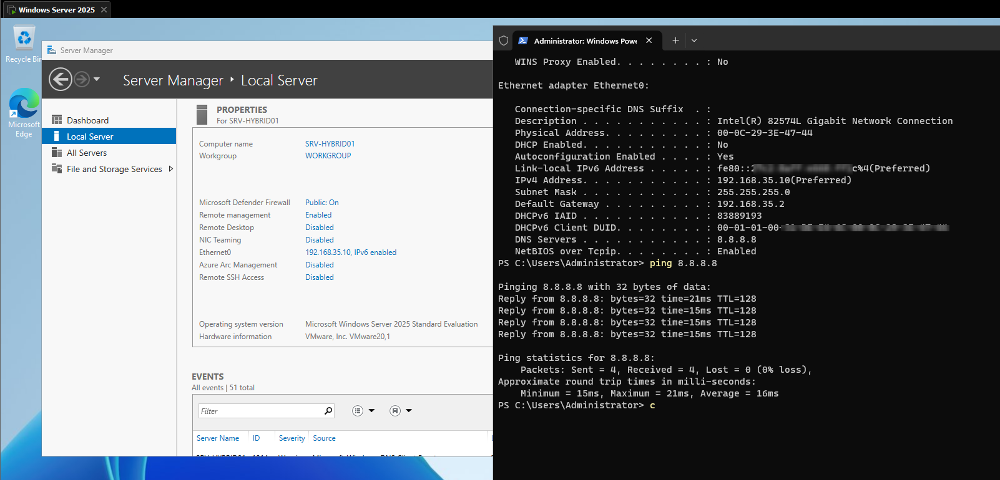 | 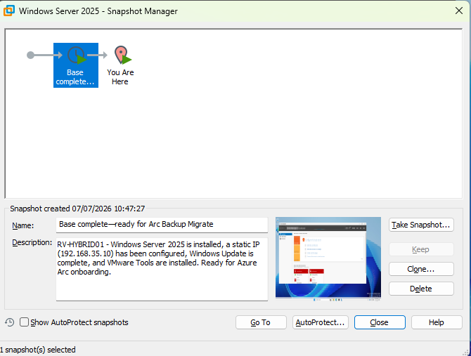 |
| *Netzwerkkonfiguration verifiziert — 192.168.35.10, Internetzugang bestätigt* | *Snapshot "Basis fertig" erfolgreich erstellt* |

---

## Bonus 1 — Domain Controller

> 💡 Das Lab-Dokument enthält einen optionalen Bonus-Teil zur Vorbereitung von Microsoft Entra Connect Cloud Sync: Der Server wird zu einem Active Directory Domain Controller heraufgestuft.

### Durchgeführte Schritte

- AD DS-Rolle installiert
- Server zu Domain Controller heraufgestuft — neue Gesamtstruktur `hybridlink.local`
- DNS-Client auf sich selbst umgestellt (`192.168.35.10`, Fallback `8.8.8.8`)
- Organisationseinheit `HybridLink-Users` und Testbenutzer `Anna Test` (`a.test`) angelegt
- Finaler Snapshot **"DC fertig – bereit für Entra Connect"** erstellt

> 🔑 **Erkenntnis 3 — Leeres Administrator-Passwort blockiert Domain-Promotion:** Durch die automatische Anmeldung (Auto-Logon) aus dem Easy-Install-Prozess blieb das lokale Administrator-Passwort leer. Active Directory verweigerte die Domain-Promotion, da dieses Konto automatisch zum Domain-Administrator wird und damit den Passwort-Richtlinien entsprechen muss. Lösung: `net user Administrator "<StrongPassword>" /passwordreq:yes` vor der Promotion ausführen.

```powershell
# Fix: Set a strong password for the local Administrator account
# before promoting the server to a Domain Controller
net user Administrator "Pa$$w0rd2026!Lab" /passwordreq:yes
```

| | |
|--|--|
| 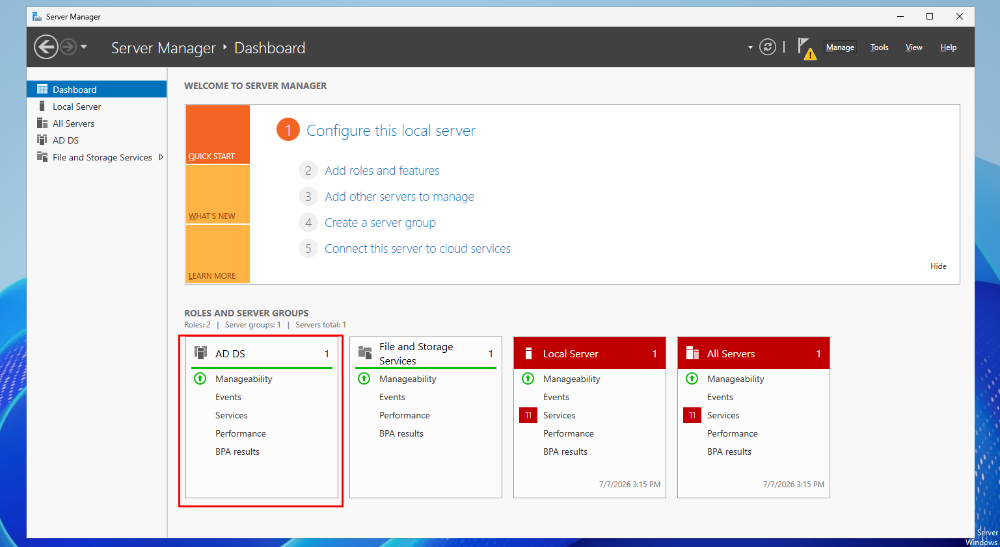 | 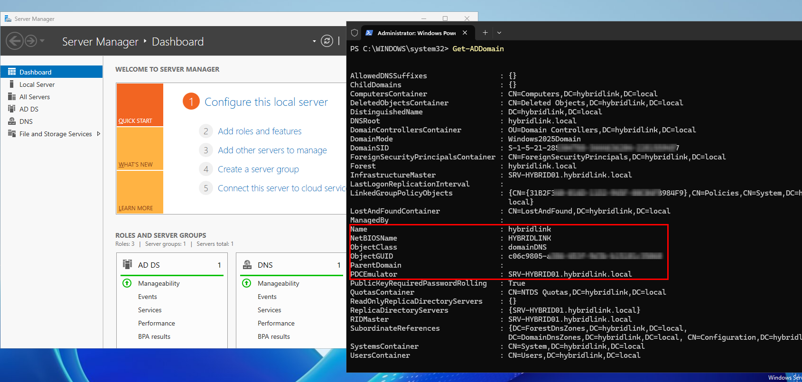 |
| *AD DS-Rolle installiert* | *Domain Controller erfolgreich heraufgestuft — hybridlink.local* |
| 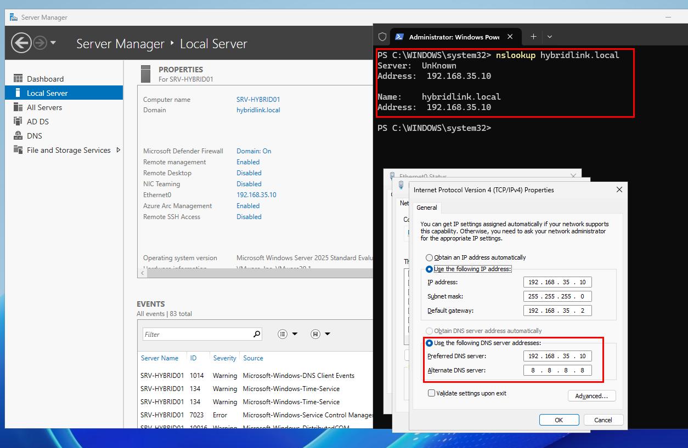 | 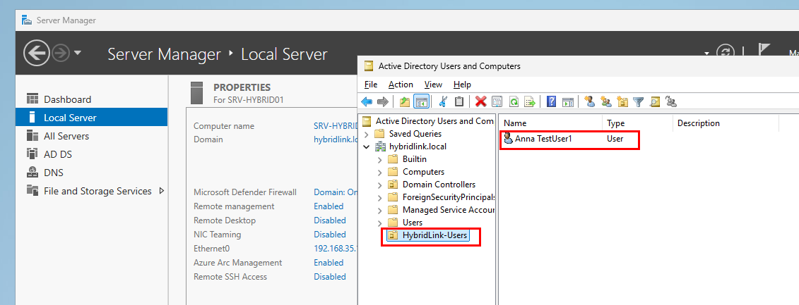 |
| *DNS zeigt erfolgreich auf sich selbst* | *Testbenutzer Anna Test in OU HybridLink-Users angelegt* |
| 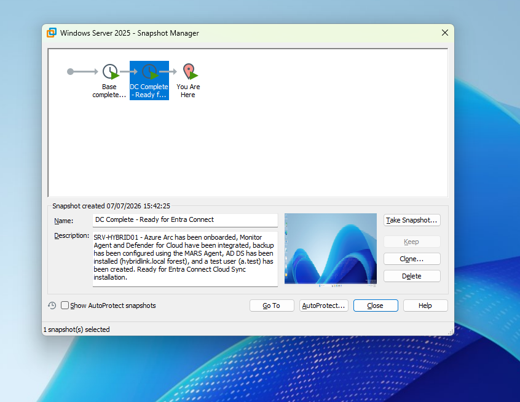 | |
| *Finaler Snapshot "DC fertig – bereit für Entra Connect"* | |

---

## Bonus 2.1 — Resource Group

> 💡 Eine Resource Group ist der logische Container für alle Azure-Ressourcen dieses Projekts — getrennt von anderen Portfolio-Projekten für saubere Kostenverfolgung und Dokumentation.

### Ressource erstellt

- **rg-hybridlink-arc** — Sweden Central
- Tags: `Environment=Lab`, `Project=hybridlink-arc`, `Owner=Emre`
- Custom Policy **"Require a tag on resources"** (Tag `Environment`) zugewiesen — Deny-Effekt

```bash
az group create \
  --name rg-hybridlink-arc \
  --location swedencentral \
  --tags Environment=Lab Project=hybridlink-arc Owner=Emre
```

> 🔑 **Erkenntnis 4 — Tag-Policy mit Deny-Effekt betrifft jede Sub-Ressource:** Eine "Require a tag"-Policy auf Resource-Group-Ebene blockiert **jede neu erstellte Ressource** in dieser Gruppe — inklusive Sub-Ressourcen wie Arc-Extensions und Migrate-Projekten, die über Portal-Assistenten oft **keinen** Tags-Tab anbieten. Das erzwingt in solchen Fällen den Wechsel auf die Azure CLI.

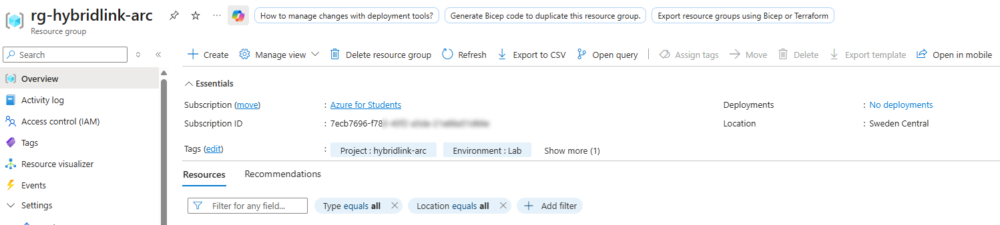

*rg-hybridlink-arc erfolgreich erstellt — Sweden Central*

---

## Bonus 2.2 — Azure Arc Onboarding

> 💡 Azure Arc erweitert die Azure-Kontrollebene auf on-premises Server — der Server erscheint als verwaltbare Ressource in Azure, ohne migriert zu werden.

### Durchgeführte Schritte

- Onboarding-Skript über Azure Portal generiert (Public Endpoint, manuelle Authentifizierung)
- Skript auf `SRV-HYBRID01` als Administrator ausgeführt
- Interaktive Browser-Authentifizierung durchgeführt
- Server erfolgreich als **Connected** registriert

```powershell
# Allow the onboarding script to run for this session only (no permanent policy change)
Set-ExecutionPolicy -ExecutionPolicy Bypass -Scope Process -Force
.\OnboardingScript.ps1
```

> 🔑 **Erkenntnis 5 — Die "Servers"-Ansicht ist nicht direkt im linken Menü:** Im aktuellen Azure-Arc-Portal-Design befindet sich der Einstiegspunkt für einzelne Server unter **Overview → "Machines"**-Kachel, nicht als eigener Menüpunkt in der linken Navigationsleiste.

| | |
|--|--|
| 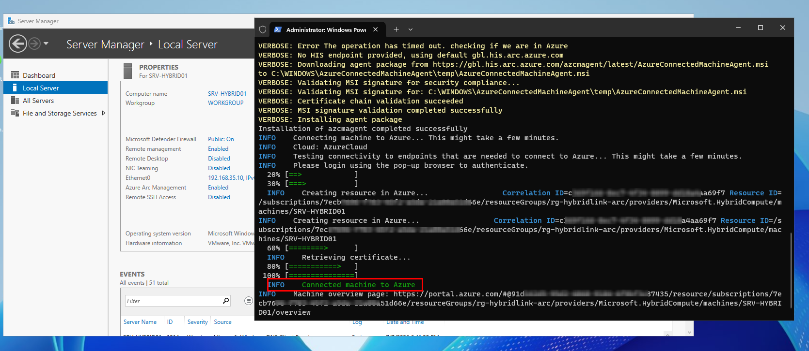 | |
| *SRV-HYBRID01 erfolgreich mit Azure Arc verbunden* | |

---

## Bonus 2.3 — Policy, Monitor & Defender

> 💡 Sobald ein Server über Arc verwaltet wird, können dieselben Governance- und Sicherheitswerkzeuge angewendet werden wie bei nativen Azure-VMs.

### Durchgeführte Schritte

- Policy-Compliance verifiziert — `rg-hybridlink-arc` zu 100 % konform mit Tag-Policy
- Azure Monitor Agent (AMA) als Arc-Extension installiert
- Microsoft Defender for Cloud (Foundational CSPM, kostenlose Stufe) aktiviert

```bash
# Install Azure Monitor Agent extension on the Arc-connected server
az connectedmachine extension create \
  --name AzureMonitorWindowsAgent \
  --publisher Microsoft.Azure.Monitor \
  --type AzureMonitorWindowsAgent \
  --machine-name "SRV-HYBRID01" \
  --resource-group "rg-hybridlink-arc" \
  --location "swedencentral" \
  --tags Environment=Lab Project=hybridlink-arc Owner=Emre
```

> 🔑 **Erkenntnis 6 — Beschädigter Download-Cache blockiert Extension-Installation:** Ein fehlgeschlagener erster Versuch (Policy-Deny) hinterließ einen unvollständigen Extension-Download im lokalen Cache (`boost::filesystem::copy_file: The file exists`). Lösung: betroffene Dienste stoppen, `GuestConfig\downloads`-Cache leeren, Dienste neu starten, Extension erneut anfordern.

> 🔑 **Erkenntnis 7 — Defender-Sync-Verzögerung:** Neu Arc-registrierte Server erscheinen nicht sofort im Defender-for-Cloud-Inventar — bekannte Synchronisationsverzögerung (teils mehrere Stunden), die auch mit `az policy state trigger-scan` nur bedingt beschleunigt werden kann.

| | |
|--|--|
| 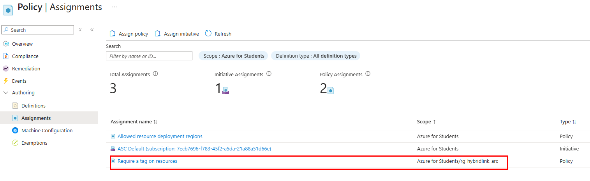 | 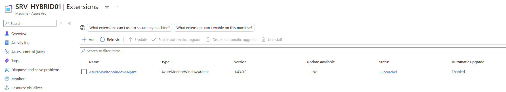 |
| *Tag-Policy — 100 % konform* | *Azure Monitor Agent erfolgreich installiert* |

---

## Bonus 2.4 — Azure Backup (MARS Agent)

> 💡 On-premises Server können nicht wie native Azure-VMs direkt durch Azure gesichert werden — stattdessen sammelt ein lokaler Agent (MARS) Dateien und überträgt sie in den Cloud-Tresor.

### Durchgeführte Schritte

- Recovery Services Vault `rsv-hybridlink-backup` erstellt, Storage Replication auf **LRS** gesetzt
- MARS Agent (Microsoft Azure Recovery Services Agent) auf `SRV-HYBRID01` installiert und registriert
- Verschlüsselungs-Passphrase generiert und sicher auf dem Host-PC gespeichert (nicht im Repository!)
- Backup-Zeitplan konfiguriert: **täglich**, Retention auf **7 Tage** reduziert (Weekly/Monthly/Yearly deaktiviert)
- Testordner `BackupTest` gesichert, erster manueller Backup-Job erfolgreich abgeschlossen

```bash
az backup vault create \
  --resource-group "rg-hybridlink-arc" \
  --name "rsv-hybridlink-backup" \
  --location "swedencentral" \
  --tags Environment=Lab Project=hybridlink-arc Owner=Emre
```

> 🔑 **Erkenntnis 8 — MARS Agent ≠ VM-Snapshot-Backup:** Im Gegensatz zum VM-Backup (Enhanced Policy, siehe DataSafe-Projekt) sichert der MARS Agent auf **Datei-/Ordnerebene** — er läuft als Dienst innerhalb des Gastbetriebssystems, nicht als Hypervisor-Snapshot. Das ist die einzige Möglichkeit, on-premises Server ohne native Azure-VM-Anbindung zu schützen.

> 🔑 **Erkenntnis 9 — Standard-Retention-Policy ist für Lab-Umgebungen überdimensioniert:** Die Vorgabe (180 Tage täglich + bis zu 10 Jahre wöchentlich/monatlich/jährlich) ist für produktive Compliance-Anforderungen gedacht. Für Lab-Zwecke wurde auf 7 Tage täglich reduziert, um Speicherkosten zu minimieren.

| | |
|--|--|
| 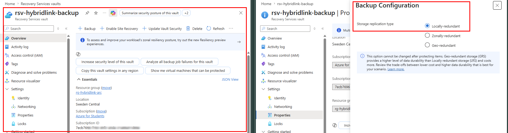 | 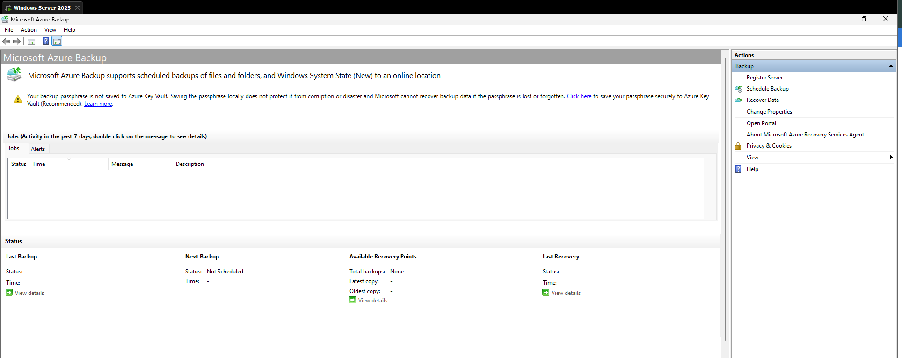 |
| *Recovery Services Vault erstellt — LRS* | *MARS Agent erfolgreich registriert* |
| 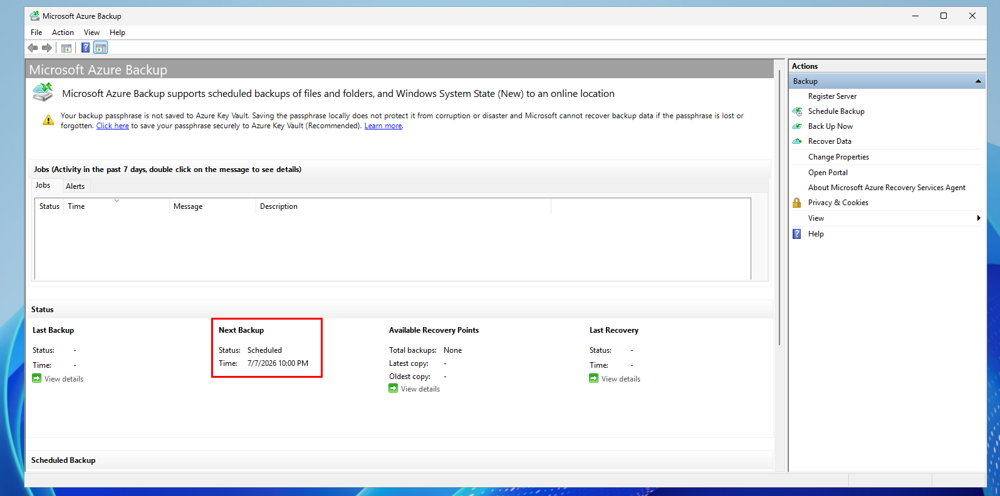 | 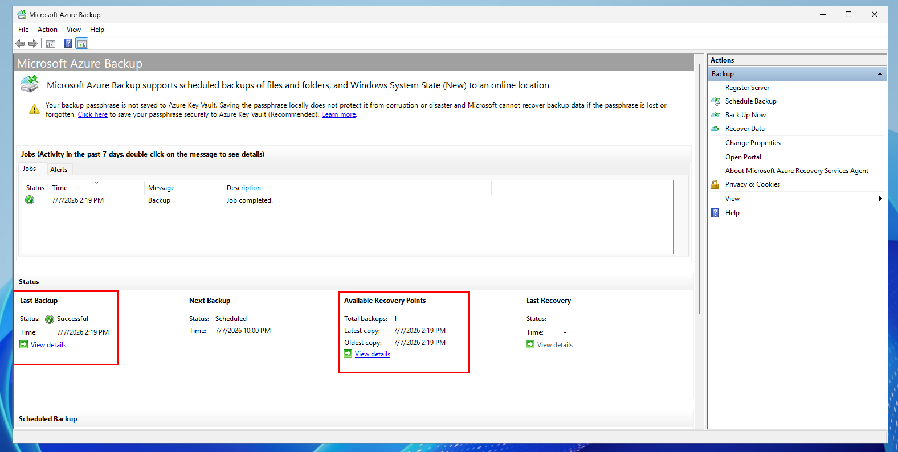 |
| *Backup-Zeitplan konfiguriert* | *Erster Backup-Job erfolgreich abgeschlossen* |

### 🔄 Recovery-Verifizierung (Restore-Test)

Ein Backup ist nur so gut wie seine nachgewiesene Wiederherstellbarkeit. Daher wurde zusätzlich ein vollständiger Restore-Test durchgeführt:

- Recovery Point vom 8.7.2026 als Laufwerk (`E:\`) gemountet
- `BackupTest`-Ordner an einen neuen Ort (`Desktop\Restore-Test`) kopiert
- Dateiinhalt mit dem Original verglichen — **identisch**
- Recovery-Volume sauber ausgehängt (Unmount)

> 🔑 **Erkenntnis 9b — Doppelte VM-Kopien können zu Identitätskonflikten beim Backup-Dienst führen:** Nach dem Verschieben der VM auf den Mini-PC (per "I Copied It") teilen beide VM-Kopien (Windows-Host und Mini-PC) dieselbe MARS-Agent-Registrierungsidentität. Bei einem späteren Restore-Versuch auf der ursprünglichen Windows-Kopie trat der Fehler **"Resource not provisioned in service stamp" (ID: 230006)** auf — ein von Microsoft dokumentierter Fehlercode, der typischerweise mit Identitäts-/Namensinkonsistenzen des registrierten Servers zusammenhängt. Ein Neustart der VM löste das Problem in diesem Fall. Für produktive Umgebungen empfiehlt sich, bei VM-Duplikaten mit aktivem Backup jeweils eine frische MARS-Registrierung vorzunehmen, um Identitätskonflikte von vornherein zu vermeiden.

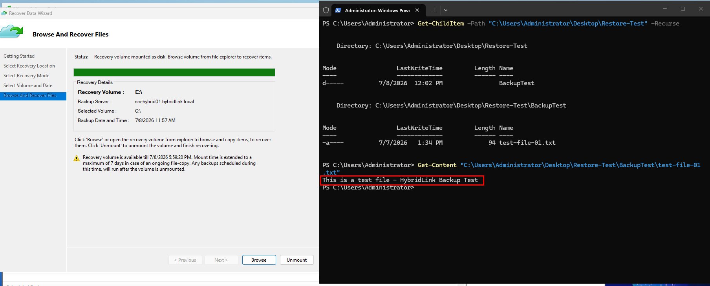

*Restore-Test erfolgreich — Dateiinhalt nach Wiederherstellung identisch mit dem Original*

---

## Bonus 2.5 — Azure Migrate

> 💡 Azure Migrate bewertet on-premises Server für eine mögliche Cloud-Migration — inklusive Sizing-Empfehlungen für Ziel-VMs in Azure.

### Durchgeführte Schritte

- Migrate-Projekt `hybridlink-migrate` via Azure CLI erstellt (Geography: Sweden)
- On-Prem-VM per USB-Transfer auf einen zweiten Host (Mini-PC, Linux, VMware Workstation Pro, 32 GB RAM) verschoben, um die Ressourcenanforderungen der Appliance (16 GB RAM, 8 vCPU) erfüllen zu können
- `Microsoft.OffAzure/masterSites`-Ressource (`hlk-appliance`) via Azure CLI erfolgreich erstellt
- **Weg 1 — Appliance:** Key-Generierung im Azure Portal in `rg-hybridlink-arc` **dauerhaft blockiert** (Endlosschleife, kein Fehler)
- **Weg 2 — CSV Import (appliance-frei):** `Microsoft.OffAzure/importSites` sowie beide `Microsoft.Migrate/migrateProjects/Solutions`-Ressourcen (Discovery + Assessment) via CLI nachträglich erstellt, um die Portal-Voraussetzungen zu erfüllen — **Import blieb dennoch auf "Preparing your project for importing machines" hängen**
- Offizielles Azure-Support-Ticket eröffnet, um die Ursache zu klären (siehe unten)
- **Durchbruch:** Appliance-Key-Generierung in einer komplett policy-freien, neu erstellten Resource Group getestet — **sofort erfolgreich**, Root Cause damit bestätigt
- Appliance vollständig auf einer dedizierten VM bereitgestellt, Discovery erfolgreich durchgeführt und ein echtes Assessment mit konkreter VM-SKU-Empfehlung erzeugt

```bash
# Migrate project (see Bonus 2.1 pattern: stable API version + --is-full-object)
az resource create \
  --resource-group "rg-hybridlink-arc" \
  --name "hybridlink-migrate" \
  --resource-type "Microsoft.Migrate/migrateProjects" \
  --api-version "2020-06-01-preview" \
  --is-full-object \
  --properties '{
    "location": "swedencentral",
    "tags": { "Environment": "Lab", "Project": "hybridlink-arc", "Owner": "Emre" },
    "properties": {}
  }'

# masterSites (backing appliance key generation)
az resource create \
  --resource-group "rg-hybridlink-arc" \
  --name "hlk-appliance" \
  --resource-type "Microsoft.OffAzure/masterSites" \
  --api-version "2023-06-06" \
  --is-full-object \
  --properties '{
    "location": "swedencentral",
    "tags": { "Environment": "Lab", "Project": "hybridlink-arc", "Owner": "Emre" },
    "properties": { "allowMultipleSites": false, "publicNetworkAccess": "Enabled" }
  }'

# importSites (backing CSV-based, appliance-free discovery)
az resource create \
  --resource-group "rg-hybridlink-arc" \
  --name "hlk-import-site" \
  --resource-type "Microsoft.OffAzure/importSites" \
  --api-version "2023-06-06" \
  --is-full-object \
  --properties '{
    "location": "swedencentral",
    "tags": { "Environment": "Lab", "Project": "hybridlink-arc", "Owner": "Emre" },
    "properties": {}
  }'

# Discovery + Assessment "Solutions" that a normal Portal project-creation
# flow would have added automatically — missing because the project was
# created directly via CLI
az resource create \
  --resource-group "rg-hybridlink-arc" \
  --name "hybridlink-migrate/Servers-Discovery-ServerDiscovery" \
  --resource-type "Microsoft.Migrate/migrateProjects/Solutions" \
  --api-version "2020-05-01" \
  --is-full-object \
  --properties '{
    "tags": { "Environment": "Lab", "Project": "hybridlink-arc", "Owner": "Emre" },
    "properties": { "tool": "ServerDiscovery", "purpose": "Discovery", "goal": "Servers", "status": "Active" }
  }'

az resource create \
  --resource-group "rg-hybridlink-arc" \
  --name "hybridlink-migrate/Servers-Assessment-ServerAssessment" \
  --resource-type "Microsoft.Migrate/migrateProjects/Solutions" \
  --api-version "2020-05-01" \
  --is-full-object \
  --properties '{
    "tags": { "Environment": "Lab", "Project": "hybridlink-arc", "Owner": "Emre" },
    "properties": { "tool": "ServerAssessment", "purpose": "Assessment", "goal": "Servers", "status": "Active" }
  }'
```

### ⚠️ Root-Cause-Analyse — Zwei unabhängige Wege, ein gemeinsamer Blocker

Beide Discovery-Wege (appliance-basiert und CSV-Import) blieben unabhängig voneinander in einer Endlosschleife hängen, ohne sichtbaren Fehler. Es wurde eine systematische Ausschlussdiagnose durchgeführt:

| # | Hypothese | Test | Ergebnis |
|---|---|---|---|
| 1 | Tag-Policy blockiert eine verdeckte Sub-Ressource | Policy temporär auf `DoNotEnforce` gesetzt | ❌ Fehler bestand weiterhin |
| 2 | Fehlende Berechtigung zur Erstellung einer Microsoft Entra ID App Registration | Test-App via `az ad app create` erstellt | ✅ Erfolgreich — keine Einschränkung |
| 3 | Fehlende RBAC-Rollenzuweisungsberechtigung | Service Principal erstellt, Contributor-Rolle zugewiesen | ✅ Erfolgreich — keine Einschränkung |
| 4 | Fehlende Backend-Ressourcen (masterSites, importSites, Solutions) | Alle vier Ressourcen einzeln via CLI nachgebaut | ✅ Alle erfolgreich erstellt — Blockade bestand trotzdem weiter |
| 5 | MSA-backed/"Guest"-Identität blockiert den Zugriff (analog zum Cloud-Sync-Fund in Bonus 3) | Appliance-Key-Generierung mit nativem `emreadmin`-Konto (statt `okayemre@hotmail.com`) wiederholt | ❌ Identischer Fehler — Hypothese widerlegt |
| 6 | Die bloße **Anwesenheit** der Deny-Tag-Policy in `rg-hybridlink-arc` beeinflusst den internen Portal-Workflow, unabhängig vom CLI-Workaround | Appliance-Key-Generierung in einer komplett neuen, policy-freien Resource Group (`rg-migrate-test-clean`) wiederholt | ✅ **Key sofort erfolgreich generiert — Root Cause bestätigt** |

Alle Testressourcen wurden anschließend bereinigt, die Policy wieder auf `Default` zurückgesetzt.

**Klärungsversuch über offiziellen Azure-Support:** Ein Support-Ticket wurde eröffnet, um die Ursache direkt bei Microsoft zu klären. Dabei zeigte sich ein entscheidender, offiziell dokumentierter Fakt: *"With your Basic support plan, you can create support requests for billing, subscription management, and quota increase. For technical support, upgrade to a paid support plan."* — **Azure-for-Students-Abonnements laufen standardmäßig im Basic-Support-Tarif, der technische Support-Anfragen wie diese grundsätzlich ausschließt.** Da eine offizielle Klärung damit ausschied, wurde die Ausschlussdiagnose in Eigenregie fortgesetzt (Hypothesen 5 und 6).

**Root Cause bestätigt:** Der entscheidende Test war Hypothese 6 — Appliance-Key-Generierung in einer Resource Group **ganz ohne** die "Require a tag"-Policy. Das Ergebnis war eindeutig und sofort: grünes Häkchen, *"All resources have been created successfully."* Die Erklärung dafür ist technisch konsistent mit allem, was zuvor beobachtet wurde: Der Portal-Wizard erstellt seine Backend-Ressourcen **automatisch, ohne Tags** — genau das, was die Deny-Policy blockiert. Unsere eigenen `az resource create --is-full-object`-Aufrufe funktionierten nur deshalb, weil wir die Tags dabei selbst mitgeliefert haben. `DoNotEnforce` reicht dabei nicht aus, um dieses Verhalten zu neutralisieren — nur die vollständige Abwesenheit der Policy-Zuweisung tut das. Die MSA-Identitätshypothese (5) ist damit ebenfalls endgültig vom Tisch.

Bis zu diesem Durchbruch diente eine manuelle Sizing-Einschätzung als Zwischenlösung:

| On-Prem-Ressource | Manuell geschätzte Azure-VM-SKU | Begründung |
|---|---|---|
| 2 vCPU, 4 GB RAM | `Standard_B2s` / `Standard_B2ats_v2` | Burstable, kosteneffizient für Lab-/Testlasten |
| 60 GB Disk | Standard SSD (E15, 64 GB) | Ausreichende Performance für Test-Workloads |

### ✅ Durchbruch — Appliance-Bereitstellung, Discovery und echtes Assessment

Mit bestätigtem Root Cause wurde die komplette Discovery/Assessment-Kette in der sauberen Resource Group (`rg-migrate-test-clean`, Projekt `migrate-lab`) end-to-end durchgeführt — inklusive einer vollständigen, produktionsnahen Appliance-Bereitstellung (nicht nur Key-Generierung).

**Appliance-VM:** Eine neue, dedizierte VM `MIG-APPLIANCE01` wurde auf dem Mini-PC erstellt (Windows Server 2025 Standard Evaluation, 8 vCPU, 16 GB RAM, 80 GB Disk, Bridged-Netzwerk) — passend zu den offiziellen Appliance-Mindestanforderungen. Die Appliance wurde über das offizielle PowerShell-Installationsskript (`AzureMigrateInstaller.ps1`, Szenario "Physical or other", Cloud "Azure Public") eingerichtet und erfolgreich beim Projekt registriert.

**Hindernis A — Netzwerksegmentierung:** `SRV-HYBRID01` lief bislang ausschließlich im VMware-NAT-Netz (`192.168.35.0/24`) des Windows-PC-Hosts — für die Appliance auf dem Mini-PC (Bridged-Netzwerk) **unerreichbar**, da NAT-Netze per Definition isoliert sind. Lösung: ein zweiter, Bridged-Netzwerkadapter wurde `SRV-HYBRID01` temporär hinzugefügt (neue IP `192.168.0.78`), ohne den bestehenden NAT-Adapter — und damit Domain-, DNS- und Cloud-Sync-Funktionalität — zu verändern.

**Hindernis B — WinRM-Authentifizierung über Domain-Grenzen hinweg:** Die (bewusst nicht domänenverbundene) Appliance-VM konnte sich per WinRM zunächst nicht bei `SRV-HYBRID01` authentifizieren (`Error 2147942405`, *"server name cannot be resolved"*) — Kerberos, WinRMs Standard-Authentifizierung, funktioniert nur innerhalb derselben Domain. Lösung: `TrustedHosts` auf der Appliance-VM gesetzt, um den NTLM-Fallback für dieses eine Ziel zu erlauben:
```powershell
# Run on the appliance VM (client side) to allow NTLM authentication
# to a specific domain-joined server across the workgroup/domain boundary
winrm set winrm/config/client '@{TrustedHosts="192.168.0.78"}'
```

**Hindernis C — Türkische Tastatur + NetBIOS-Format:** Die erste Windows-Credential (`HYBRIDLINK\Administrator`) schlug mit *"Access is denied"* fehl — Ursache war ein auf einer türkischen Q-Tastatur fehlerhaft eingegebenes `\`-Zeichen. Lösung: UPN-Format statt NetBIOS-Format verwendet (`Administrator@hybridlink.local`), das kein `\` benötigt und damit robuster gegenüber Tastaturlayout-Eigenheiten ist.

**Ergebnis — Discovery und Assessment erfolgreich abgeschlossen:**

| Kennzahl | Wert |
|---|---|
| Readiness | ✅ Ready (1 von 1 Servern) |
| Empfohlene VM-SKU | `Standard_D2as_v5` |
| Empfohlene Sicherheitskonfiguration | Trusted launch |
| Geschätzte monatliche Kosten | **$50.01** (Compute $25.53 · Storage $9.60 · Security $14.88) |
| Migration Blockers | Keine |
| Empfohlenes Migrationswerkzeug | Server migration |

> 🔑 **Erkenntnis 11 — `DoNotEnforce` deaktiviert eine Policy nicht vollständig:** `DoNotEnforce` unterdrückt nur die Ablehnung von Deployments durch die Policy-Engine selbst — es beseitigt nicht zwangsläufig alle internen Azure-Workflows, die allein von der **Existenz** einer Policy-Zuweisung im Scope beeinflusst werden. Der einzige zuverlässige Weg, eine Policy als Root Cause endgültig auszuschließen, ist ein Test in einer Resource Group **ganz ohne** diese Zuweisung.

> 🔑 **Erkenntnis 12 — Freie Subscriptions haben auch eingeschränkten Support-Zugang:** Azure for Students läuft im Basic-Support-Tarif, der technische Support-Tickets kategorisch ausschließt. In diesem Fall bedeutete das: keine offizielle Klärung durch Microsoft — der Root Cause musste komplett in Eigenregie durch systematische Ausschlussdiagnose gefunden werden. Dies ist ein relevanter Faktor bei der Wahl einer Subscription für produktionsnahe Lernprojekte.

> 🔑 **Erkenntnis 13 — Eine isolierte, minimale Testumgebung ist das stärkste Diagnosewerkzeug:** Monatelange Diagnose in der ursprünglichen Resource Group konnte den Root Cause nicht eindeutig belegen. Ein einziger Test in einer komplett sauberen, neu erstellten Resource Group lieferte den Beweis in Sekunden. Wenn ein Fehler sich nicht erklären lässt, ist das Reduzieren auf die kleinstmögliche, unveränderte Umgebung oft schneller als das Testen einzelner Variablen in der bestehenden, komplexen Umgebung.

> 🔑 **Erkenntnis 14 — VMware-NAT-Netze sind für externe Appliances grundsätzlich unerreichbar:** NAT-Netzwerke sind bewusst isoliert — ein Discovery-Tool auf einem anderen physischen Host kann eine VM im NAT-Netz eines anderen Hosts nicht erreichen, unabhängig von Firewall-Regeln. Ein zweiter, Bridged-Netzwerkadapter (statt einer riskanten Umkonfiguration des bestehenden NAT-Adapters) ist der sauberste Weg, ein solches Ziel temporär von außen erreichbar zu machen, ohne bestehende Dienste zu gefährden.

> 🔑 **Erkenntnis 15 — WinRM/Kerberos setzt gemeinsame Domain-Mitgliedschaft voraus:** Eine nicht domänenverbundene (workgroup) Maschine kann sich nicht per Kerberos bei einem domänenverbundenen Server authentifizieren — ein sehr häufiges Szenario bei Discovery-/Monitoring-Tools, die bewusst außerhalb der Domain betrieben werden. `TrustedHosts` auf dem WinRM-Client ist die Standardlösung, um in diesem Fall gezielt NTLM zuzulassen.

> 🔑 **Erkenntnis 16 — Lokalisierte Tastaturlayouts können Sonderzeichen in Zugangsdaten unbemerkt verfälschen:** Auf einer türkischen Q-Tastatur wird `\` über eine AltGr-Kombination erzeugt und lässt sich leicht falsch eingeben, ohne dass dies beim Tippen auffällt. Das UPN-Format (`user@domain.tld`) umgeht das `\`-Zeichen komplett und ist damit robuster als das NetBIOS-Format (`DOMAIN\user`) — besonders bei nicht-englischen Tastaturlayouts.

| | |
|--|--|
| 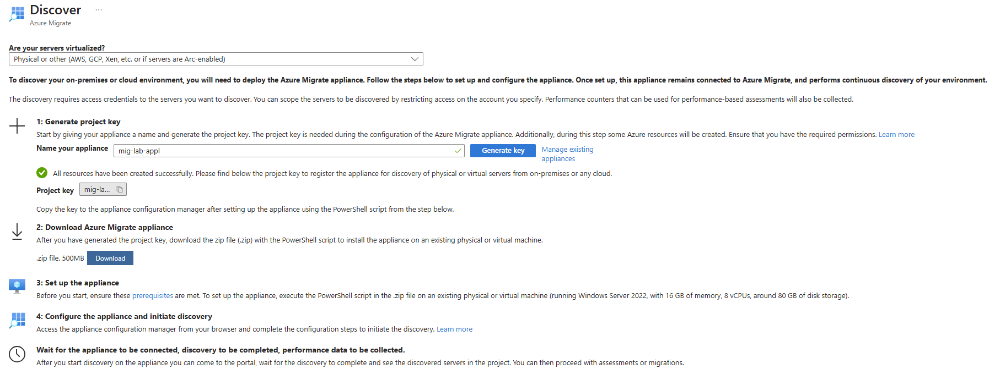 | 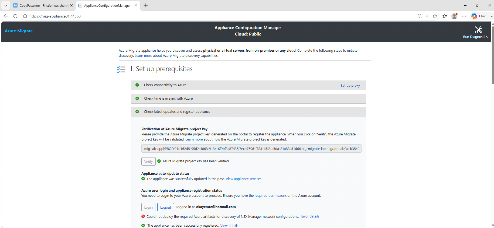 |
| *Root-Cause-Beweis: Key-Generierung in policy-freier Resource Group erfolgreich* | *Appliance erfolgreich registriert* |
| 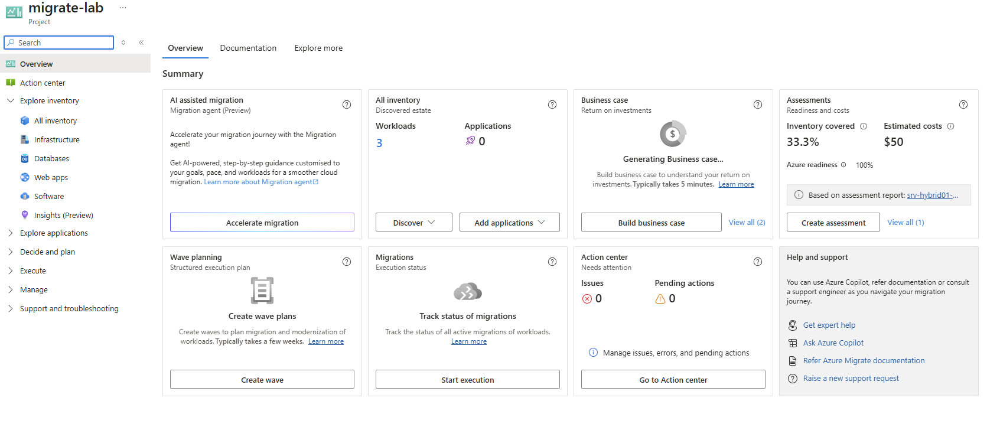 | 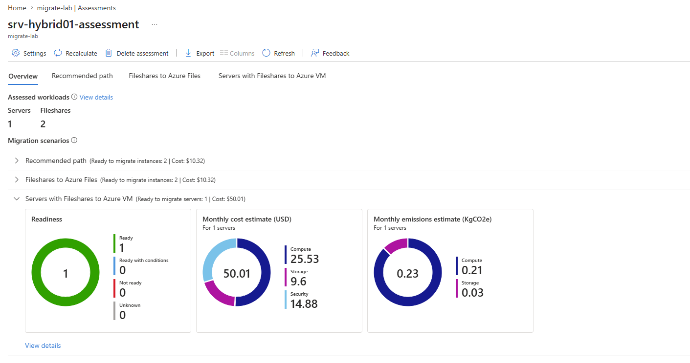 |
| *Discovery erfolgreich abgeschlossen, keine offenen Issues* | *Assessment-Übersicht: Ready, $50.01/Monat* |
| 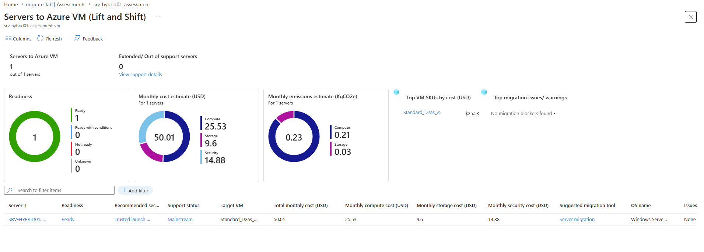 | |
| *Detaillierte VM-SKU-Empfehlung und Kostenaufschlüsselung* |

---

## Bonus 3 — Microsoft Entra Cloud Sync

> 💡 Der ursprüngliche Bonus-Teil des Lab-Dokuments (Domain-Controller-Setup) diente als Vorbereitung für Microsoft Entra Connect Cloud Sync. In diesem Abschnitt wird diese Vorbereitung tatsächlich umgesetzt: Benutzer aus dem on-premises Active Directory (`hybridlink.local`) werden automatisch nach Microsoft Entra ID synchronisiert — die Grundlage für Hybrid-Identitäten in produktiven Umgebungen.

### Durchgeführte Schritte

- Separater Member-Server `SRV-SYNC01` (kein Domain Controller) im selben VMware-Host wie `SRV-HYBRID01` erstellt und der Domäne `hybridlink.local` beigetreten
- Microsoft Entra Provisioning Agent auf `SRV-SYNC01` installiert
- Neue Cloud-Sync-Konfiguration "AD to Microsoft Entra ID sync" erstellt, inklusive Password Hash Sync
- Scoping Filter gesetzt: nur die Organisationseinheit `OU=HybridLink-Users,DC=hybridlink,DC=local` wird synchronisiert
- Konfiguration aktiviert und erste Synchronisation erfolgreich verifiziert

> 🔑 **Erkenntnis 17 — Microsoft-Konten (MSA) werden von Cloud Sync als Gast behandelt, auch wenn sie als "Member" angezeigt werden:** Beim ersten Versuch, die Cloud-Sync-Konfigurationsseite mit dem persönlichen Konto zu öffnen, erschien die Fehlermeldung *"Guest users are not allowed to configure sync"* — obwohl das Konto im Tenant als **User type: Member** gelistet war. Der entscheidende Unterschied zeigte sich erst im Attribut **Identities**: Es handelte sich um ein **MSA-backed** Konto (`MicrosoftAccount`), das intern wie ein externer Gast behandelt wird. Dieses Verhalten ist in Microsofts eigenen Community-Foren als bekanntes Problem dokumentiert. **Lösung:** Ein neues, natives (passwortbasiertes, tenant-eigenes) Global-Administrator-Konto wurde angelegt — danach funktionierte der Zugriff auf Cloud Sync sofort fehlerfrei. Diese Unterscheidung zwischen "Member laut Anzeige" und "nativ vs. MSA-backed laut Identities-Attribut" ist ein Detail, das in vielen Tutorials fehlt, in der Praxis aber entscheidend sein kann.

> 🔑 **Erkenntnis 18 — Provisioning Agent nutzt automatisch ein gMSA (group Managed Service Account):** Bei der Agent-Konfiguration wurde automatisch ein gMSA (`hybridlink.local\provAgentgMSA`) für den Sync-Dienst erstellt — ein Best-Practice-Ansatz, da gMSA-Passwörter automatisch von Active Directory rotiert werden und keine manuelle Passwortverwaltung erfordern. Voraussetzung dafür ist ein bereits vorhandener KDS Root Key im Forest; falls dieser fehlt, kann er mit `Add-KdsRootKey -EffectiveTime (Get-Date).AddHours(-10)` (PowerShell auf dem DC) sofort nutzbar erstellt werden.

> 🔑 **Erkenntnis 19 — Scoping Filter als Least-Privilege-Prinzip:** Ohne Scoping Filter synchronisiert Cloud Sync standardmäßig **alle** Objekte aller konfigurierten Domänen — inklusive potenziell sensibler Objekte wie eingebauter Konten. Durch die gezielte Begrenzung auf `OU=HybridLink-Users` wird nur die tatsächlich benötigte Untermenge an Benutzern synchronisiert, was Prinzipien der minimalen Rechtevergabe und Datensparsamkeit in der Praxis umsetzt.

| | |
|--|--|
| 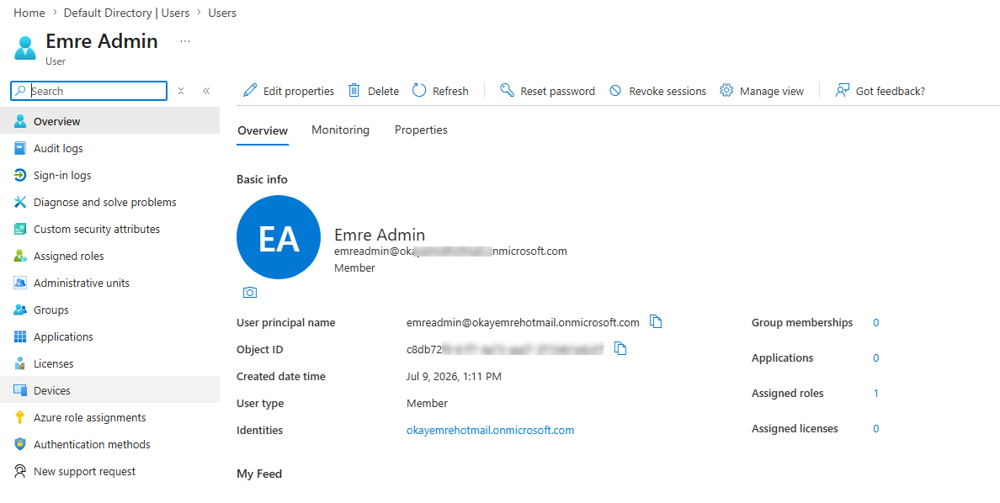 | 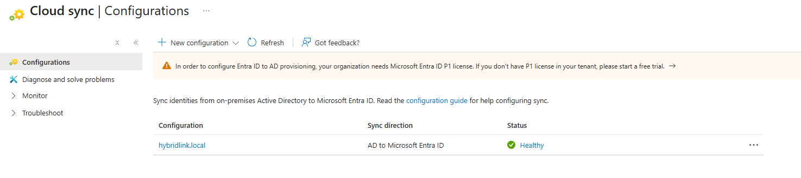 |
| *Natives Admin-Konto (Member, keine MSA-Identität) als Lösung des Guest-Fehlers* | *Cloud Sync Configurations-Seite erfolgreich erreichbar* |
| 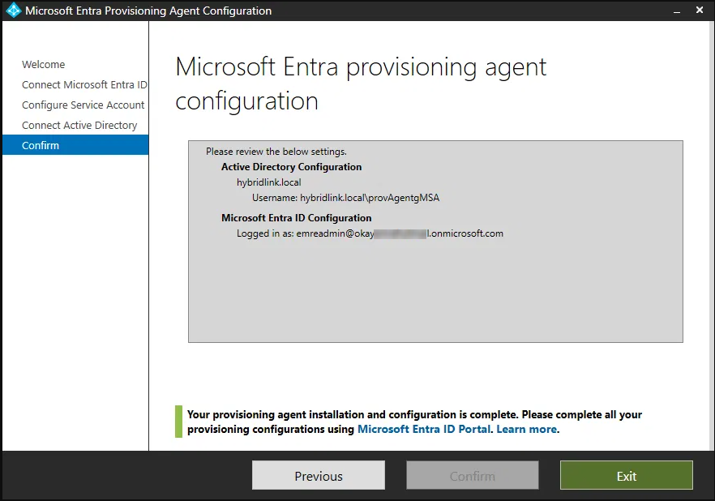 | 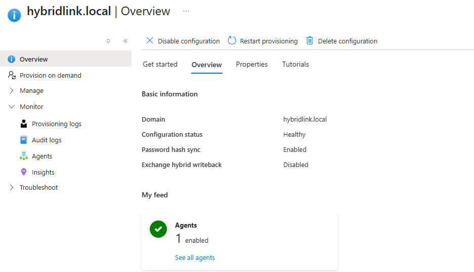 |
| *Provisioning Agent erfolgreich installiert und mit AD + Entra ID verbunden* | *Scoping Filter auf OU HybridLink-Users begrenzt* |
| 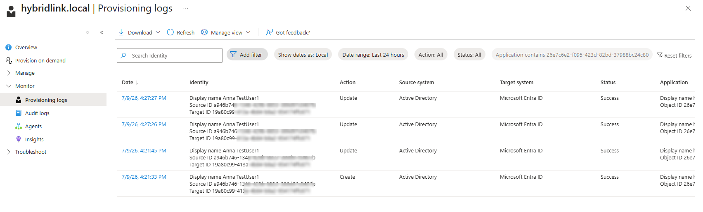 | 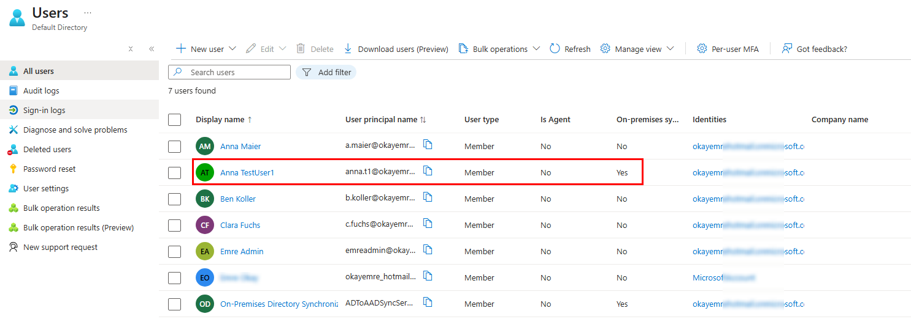 |
| *Provisioning-Logs bestätigen erfolgreiche Synchronisation* | *Finale Verifikation: Testbenutzer erfolgreich in Entra ID synchronisiert* |

---

## 🧠 Key Takeaways

| # | Erkenntnis | Warum wichtig |
|---|-----------|----------------|
| 1 | 🌐 **VMware-NAT-Subnetz ist host-spezifisch** | Lab-Dokumentation kann von der tatsächlichen Netzwerkkonfiguration abweichen |
| 2 | 📸 **Player unterstützt keine Snapshots** | Kostenloses Upgrade auf Workstation Pro löst dies ohne Neuinstallation |
| 3 | 🔐 **Auto-Logon kann leere Passwörter verschleiern** | AD-Domain-Promotion prüft Passwort-Policy und deckt dies auf |
| 4 | 🏷️ **Deny-Tag-Policies betreffen Sub-Ressourcen** | Portal-Assistenten bieten nicht immer einen Tags-Tab — CLI als Fallback |
| 5 | 🗂️ **Beschädigter Extension-Cache blockiert Retries** | Gezielte Bereinigung ist zuverlässiger als wiederholtes Neuversuchen |
| 6 | ⏱️ **Defender-Sync kann Stunden dauern** | Bekanntes Azure-Verhalten, kein Konfigurationsfehler |
| 7 | 📦 **MARS Agent ≠ VM-Backup** | Datei-/Ordner-Backup ist der einzige Weg für on-prem Server ohne native VM |
| 8 | 🖥️ **Migrate-Appliance ist ressourcenintensiv** | 16 GB RAM + 8 vCPU können lokale Lab-Umgebungen überfordern |
| 9 | ⚙️ **CLI-Extensions können instabil sein** | Direkter ARM-Zugriff (`az resource create`) als robuster Fallback |
| 10 | 🔍 **Systematische Ausschlussdiagnose statt Rätselraten** | Policy, Identität und RBAC einzeln getestet, um die Fehlerursache einzugrenzen |
| 11 | 🚧 **Manche Fehler bleiben ungeklärt** | Studenten-Subscriptions und Preview-APIs haben reale, teils undokumentierte Grenzen |
| 12 | 🎫 **Freier Support-Tarif schließt technische Tickets aus** | Azure for Students (Basic Support) bietet keinen offiziellen Eskalationsweg für Plattformfehler |
| 13 | 🧪 **Isolierte Testumgebung schlägt monatelange Diagnose** | Ein Test in einer komplett sauberen Resource Group bestätigte den Root Cause in Sekunden |
| 14 | 🔌 **VMware-NAT-Netze sind von außen unerreichbar** | Ein zweiter Bridged-Adapter macht eine Ziel-VM erreichbar, ohne bestehende Dienste zu riskieren |
| 15 | 🔐 **WinRM/Kerberos braucht gemeinsame Domain-Mitgliedschaft** | `TrustedHosts` erlaubt gezielt NTLM für workgroup↔domain-Szenarien |
| 16 | ⌨️ **Tastaturlayout kann Zugangsdaten unbemerkt verfälschen** | UPN-Format (`user@domain`) ist robuster als NetBIOS-Format (`DOMAIN\user`) auf nicht-englischen Layouts |
| 17 | 👤 **"Member" laut Anzeige ≠ native Identität** | MSA-backed Konten können von bestimmten Portal-Features als Gast behandelt werden — natives Konto als Lösung |

---

## 🛠️ Tools & Services


---

## 📁 Repository Structure

```
hybridlink-arc-project/
├── 📄 README.md
├── 📁 arm-templates/
├── 📁 docs/
│   └── Lab-Setup_Hybrid-Cloud-Basis.pdf
└── 📁 screenshots/
    ├── T1-01-network-verification.png
    ├── T1-02-snapshot-manager.png
    ├── B1-01-addsrole-installed.png
    ├── B1-02-domain-controller-promoted.png
    ├── B1-03-dns-pointed-to-self.png
    ├── B1-04-test-user-created.png
    ├── B1-05-final-snapshot-manager.png
    ├── B2-01-resource-group-overview.png
    ├── B2-02-arc-server-connected.png
    ├── B2-03-policy-assignment-created.png
    ├── B2-04-monitor-agent-installed.png
    ├── B2-05-recovery-vault-created.png
    ├── B2-06-mars-agent-registered.png
    ├── B2-07-backup-schedule-configured.png
    ├── B2-08-first-backup-completed.png
    ├── B2-11-restore-test-completed.png
    ├── B2-13-clean-rg-key-generation-success.png
    ├── B2-14-appliance-registered.png
    ├── B2-15-discovery-successful.png
    ├── B2-16-assessment-overview.png
    ├── B2-17-assessment-vm-details.png
    ├── B3-01-emreadmin-native-identity.png
    ├── B3-02-cloud-sync-access-resolved.png
    ├── B3-03-provisioning-agent-installed.png
    ├── B3-04-scoping-filter-ou.png
    ├── B3-05-provisioning-logs-success.png
    └── B3-06-anna-user-synced.png
```

---

> *Basierend auf einer offiziellen Lab-Setup-Anleitung · Erweitert um Azure-Hybrid-Cloud-Integration · Sweden Central · Azure for Students Subscription · Juli 2026*

<br>
<br>

---

# English

<a name="english"></a>

Hands-on hybrid cloud project: An on-premises Windows Server 2025 VM is prepared and then connected to Microsoft Azure — via **Azure Arc**, **Azure Backup**, and **Azure Migrate** — for the fictional company **HybridLink GmbH**.

This project is based on an official lab setup guide (basis server preparation) and extends it with a full hybrid cloud integration into Azure.

> 📄 **Original document:** [Lab-Setup_Hybrid-Cloud-Basis.pdf](docs/Lab-Setup_Hybrid-Cloud-Basis.pdf)

---

## 📋 Table of Contents

| | Task | Topic | Source | Status |
|--|------|-------|--------|--------|
| 📄 | [Part 1 — Basis Server Preparation](#part-1--basis-server-preparation) | VMware VM, Windows Server 2025, Networking | Lab document | ✅ |
| 📄 | [Bonus 1 — Domain Controller](#bonus-1--domain-controller-1) | AD DS, domain promotion, test user | Lab document (Bonus) | ✅ |
| 🔵 | [Bonus 2.1 — Resource Group](#bonus-21--resource-group-1) | Project foundation in Azure | Own extension | ✅ |
| 🔵 | [Bonus 2.2 — Azure Arc Onboarding](#bonus-22--azure-arc-onboarding-1) | Server registration with Azure | Own extension | ✅ |
| 🔵 | [Bonus 2.3 — Policy, Monitor & Defender](#bonus-23--policy-monitor--defender-1) | Governance & security | Own extension | ✅ |
| 🔵 | [Bonus 2.4 — Azure Backup (MARS Agent)](#bonus-24--azure-backup-mars-agent-1) | On-prem backup to the cloud | Own extension | ✅ |
| 🔵 | [Bonus 2.5 — Azure Migrate](#bonus-25--azure-migrate-1) | Migration assessment | Own extension | ✅ |
| 🔵 | [Bonus 3 — Microsoft Entra Cloud Sync](#bonus-3--microsoft-entra-cloud-sync-1) | AD user synchronization to Entra ID | Own extension | ✅ |

> ℹ️ **Note on structure:** *Part 1* and *Bonus 1* come directly from the official lab setup guide. *Bonus 2* (Azure hybrid integration) is **not** part of the original document — it's an independent extension to demonstrate the full hybrid cloud lifecycle.

---

## 🏗️ Infrastructure Overview

| Resource | Name | Configuration |
|----------|------|----------------|
| Hypervisor | VMware Workstation Pro | Free for personal use |
| Virtual Machine | `SRV-HYBRID01` | Windows Server 2025 Standard Evaluation, 2 vCPU, 4 GB RAM, 60 GB disk |
| Network | NAT (VMnet8) | `192.168.35.10/24` · Gateway `192.168.35.2` · DNS `8.8.8.8` → later `192.168.35.10` |
| Resource Group | `rg-hybridlink-arc` | Sweden Central |
| Azure Arc | `SRV-HYBRID01` | Connected Machine Agent, public endpoint |
| Recovery Services Vault | `rsv-hybridlink-backup` | Sweden Central · LRS |
| Azure Migrate Project | `hybridlink-migrate` (blocked) / `migrate-lab` (successful) | Geography: Sweden · Recommended SKU: `Standard_D2as_v5` · $50.01/month |
| Active Directory | `hybridlink.local` | Forest/domain, NetBIOS `HYBRIDLINK` |
| Member Server | `SRV-SYNC01` | Domain member (not a DC), Provisioning Agent host |
| Microsoft Entra Cloud Sync | `hybridlink.local` configuration | Scope: OU `HybridLink-Users`, Password Hash Sync enabled |

---

## Part 1 — Basis Server Preparation

> 💡 Before a server can be connected to Azure Arc, Backup, or Migrate, it needs a functioning, network-ready on-premises VM as its foundation.

### Steps performed (per lab document)

- Downloaded Windows Server 2025 Evaluation ISO
- Created VM `SRV-HYBRID01` in VMware (2 vCPU, 4 GB RAM, 60 GB disk, NAT)
- Installed Windows Server 2025 Standard Evaluation (Desktop Experience) via Easy Install
- Set computer name to `SRV-HYBRID01`
- Configured static IP
- Installed VMware Tools
- Created snapshot **"Basis fertig"**

> 🔑 **Key insight 1 — VMware NAT subnet deviated from the document:** The lab document assumed `192.168.100.0/24`, but VMware Workstation had automatically assigned `192.168.35.0/24` as the NAT subnet (VMnet8) on this host. Rather than changing the VMware network configuration (risking other VMs on the host), the VM's IP was adapted to the actual subnet — a realistic example of network plans diverging from documentation in practice.

> 🔑 **Key insight 2 — VMware Player doesn't support snapshots:** The snapshot feature isn't available in VMware Workstation **Player**. Since Broadcom made Workstation **Pro** free for personal use starting November 2024, an upgrade to Pro was performed — VM files are fully compatible between Player and Pro, so no reinstallation was needed.

| | |
|--|--|
|  |  |
| *Network configuration verified — 192.168.35.10, internet access confirmed* | *"Basis fertig" snapshot successfully created* |

---

## Bonus 1 — Domain Controller

> 💡 The lab document includes an optional bonus section to prepare for Microsoft Entra Connect Cloud Sync: the server is promoted to an Active Directory Domain Controller.

### Steps performed

- Installed the AD DS role
- Promoted the server to a Domain Controller — new forest `hybridlink.local`
- Pointed the DNS client to itself (`192.168.35.10`, fallback `8.8.8.8`)
- Created organizational unit `HybridLink-Users` and test user `Anna Test` (`a.test`)
- Created final snapshot **"DC fertig – bereit für Entra Connect"**

> 🔑 **Key insight 3 — Blank Administrator password blocks domain promotion:** Auto-logon from the Easy Install process left the local Administrator password blank. Active Directory refused the domain promotion, since this account automatically becomes the Domain Administrator and must therefore meet password policy requirements. Fix: run `net user Administrator "<StrongPassword>" /passwordreq:yes` before promotion.

```powershell
# Fix: Set a strong password for the local Administrator account
# before promoting the server to a Domain Controller
net user Administrator "Pa$$w0rd2026!Lab" /passwordreq:yes
```

| | |
|--|--|
|  |  |
| *AD DS role installed* | *Domain Controller successfully promoted — hybridlink.local* |
|  |  |
| *DNS successfully points to itself* | *Test user Anna Test created in OU HybridLink-Users* |
|  | |
| *Final snapshot "DC fertig – bereit für Entra Connect"* | |

---

## Bonus 2.1 — Resource Group

> 💡 A resource group is the logical container for all Azure resources in this project — kept separate from other portfolio projects for clean cost tracking and documentation.

### Resource created

- **rg-hybridlink-arc** — Sweden Central
- Tags: `Environment=Lab`, `Project=hybridlink-arc`, `Owner=Emre`
- Custom policy **"Require a tag on resources"** (tag `Environment`) assigned — deny effect

```bash
az group create \
  --name rg-hybridlink-arc \
  --location swedencentral \
  --tags Environment=Lab Project=hybridlink-arc Owner=Emre
```

> 🔑 **Key insight 4 — A deny-effect tag policy affects every sub-resource:** A "Require a tag" policy at the resource group level blocks **every newly created resource** in that group — including sub-resources like Arc extensions and Migrate projects, whose portal wizards often **don't** offer a Tags tab. This forces a fallback to the Azure CLI in such cases.


*rg-hybridlink-arc successfully created — Sweden Central*

---

## Bonus 2.2 — Azure Arc Onboarding

> 💡 Azure Arc extends the Azure control plane to on-premises servers — the server appears as a manageable resource in Azure without being migrated.

### Steps performed

- Generated the onboarding script via the Azure Portal (public endpoint, manual authentication)
- Ran the script on `SRV-HYBRID01` as Administrator
- Completed interactive browser authentication
- Server successfully registered as **Connected**

```powershell
# Allow the onboarding script to run for this session only (no permanent policy change)
Set-ExecutionPolicy -ExecutionPolicy Bypass -Scope Process -Force
.\OnboardingScript.ps1
```

> 🔑 **Key insight 5 — The "Servers" view isn't directly in the left menu:** In the current Azure Arc portal design, the entry point for individual servers sits under **Overview → "Machines"** tile, rather than as a dedicated item in the left navigation.

| | |
|--|--|
|  | |
| *SRV-HYBRID01 successfully connected to Azure Arc* | |

---

## Bonus 2.3 — Policy, Monitor & Defender

> 💡 Once a server is managed via Arc, the same governance and security tooling used for native Azure VMs can be applied to it.

### Steps performed

- Verified policy compliance — `rg-hybridlink-arc` at 100% compliant with the tag policy
- Installed Azure Monitor Agent (AMA) as an Arc extension
- Enabled Microsoft Defender for Cloud (Foundational CSPM, free tier)

```bash
# Install Azure Monitor Agent extension on the Arc-connected server
az connectedmachine extension create \
  --name AzureMonitorWindowsAgent \
  --publisher Microsoft.Azure.Monitor \
  --type AzureMonitorWindowsAgent \
  --machine-name "SRV-HYBRID01" \
  --resource-group "rg-hybridlink-arc" \
  --location "swedencentral" \
  --tags Environment=Lab Project=hybridlink-arc Owner=Emre
```

> 🔑 **Key insight 6 — A corrupted download cache blocks extension installation:** A failed first attempt (policy deny) left an incomplete extension download in the local cache (`boost::filesystem::copy_file: The file exists`). Fix: stop the affected services, clear the `GuestConfig\downloads` cache, restart the services, and re-request the extension.

> 🔑 **Key insight 7 — Defender sync delay:** Newly Arc-registered servers don't appear immediately in the Defender for Cloud inventory — a known synchronization delay (sometimes several hours) that `az policy state trigger-scan` can only partially accelerate.

| | |
|--|--|
|  |  |
| *Tag policy — 100% compliant* | *Azure Monitor Agent successfully installed* |

---

## Bonus 2.4 — Azure Backup (MARS Agent)

> 💡 On-premises servers can't be backed up directly by Azure the way native Azure VMs can — instead, a local agent (MARS) collects files and transfers them to the cloud vault.

### Steps performed

- Created Recovery Services Vault `rsv-hybridlink-backup`, set storage replication to **LRS**
- Installed and registered the MARS Agent (Microsoft Azure Recovery Services Agent) on `SRV-HYBRID01`
- Generated an encryption passphrase and stored it securely on the host PC (not in the repository!)
- Configured the backup schedule: **daily**, retention reduced to **7 days** (weekly/monthly/yearly disabled)
- Backed up test folder `BackupTest`, first manual backup job completed successfully

```bash
az backup vault create \
  --resource-group "rg-hybridlink-arc" \
  --name "rsv-hybridlink-backup" \
  --location "swedencentral" \
  --tags Environment=Lab Project=hybridlink-arc Owner=Emre
```

> 🔑 **Key insight 8 — MARS Agent ≠ VM snapshot backup:** Unlike VM backup (Enhanced Policy, see the DataSafe project), the MARS Agent backs up at the **file/folder level** — it runs as a service inside the guest OS rather than as a hypervisor snapshot. This is the only way to protect on-premises servers without native Azure VM integration.

> 🔑 **Key insight 9 — The default retention policy is oversized for lab environments:** The default (180 days daily + up to 10 years weekly/monthly/yearly) is designed for production compliance requirements. For lab purposes, this was reduced to 7 days daily to minimize storage costs.

| | |
|--|--|
|  |  |
| *Recovery Services Vault created — LRS* | *MARS Agent successfully registered* |
|  |  |
| *Backup schedule configured* | *First backup job completed successfully* |

### 🔄 Recovery verification (restore test)

A backup is only as good as its proven recoverability. A full restore test was therefore carried out as well:

- Mounted the July 8, 2026 recovery point as a drive (`E:\`)
- Copied the `BackupTest` folder to a new location (`Desktop\Restore-Test`)
- Compared the file content against the original — **identical**
- Cleanly unmounted the recovery volume

> 🔑 **Key insight 9b — Duplicate VM copies can cause backup-service identity conflicts:** After moving the VM to the mini PC (via "I Copied It"), both VM copies (Windows host and mini PC) shared the same MARS agent registration identity. A later restore attempt on the original Windows copy triggered the error **"Resource not provisioned in service stamp" (ID: 230006)** — a documented Microsoft error code typically tied to identity/naming inconsistencies of the registered server. Restarting the VM resolved it in this case. In production environments, it's advisable to perform a fresh MARS registration for each VM duplicate with active backup, to avoid identity conflicts from the outset.


*Restore test successful — file content after recovery matches the original exactly*

---

## Bonus 2.5 — Azure Migrate

> 💡 Azure Migrate assesses on-premises servers for a potential cloud migration — including sizing recommendations for target VMs in Azure.

### Steps performed

- Created Migrate project `hybridlink-migrate` via Azure CLI (geography: Sweden)
- Moved the on-prem VM via USB transfer to a second host (mini PC, Linux, VMware Workstation Pro, 32 GB RAM) to meet the appliance's resource requirements (16 GB RAM, 8 vCPU)
- Successfully created the `Microsoft.OffAzure/masterSites` resource (`hlk-appliance`) via Azure CLI
- **Path 1 — Appliance:** key generation in the Azure Portal in `rg-hybridlink-arc` **remained permanently blocked** (infinite loop, no error)
- **Path 2 — CSV import (appliance-free):** created `Microsoft.OffAzure/importSites` and both `Microsoft.Migrate/migrateProjects/Solutions` resources (Discovery + Assessment) via CLI afterward, to satisfy the Portal's prerequisites — **import still got stuck on "Preparing your project for importing machines"**
- Opened an official Azure support ticket to clarify the root cause (see below)
- **Breakthrough:** retested appliance key generation in a completely policy-free, newly created resource group — **succeeded immediately**, confirming the root cause
- Fully deployed the appliance on a dedicated VM, ran a successful discovery, and generated a real assessment with a concrete VM SKU recommendation

```bash
# Migrate project (same pattern as Bonus 2.1: stable API version + --is-full-object)
az resource create \
  --resource-group "rg-hybridlink-arc" \
  --name "hybridlink-migrate" \
  --resource-type "Microsoft.Migrate/migrateProjects" \
  --api-version "2020-06-01-preview" \
  --is-full-object \
  --properties '{
    "location": "swedencentral",
    "tags": { "Environment": "Lab", "Project": "hybridlink-arc", "Owner": "Emre" },
    "properties": {}
  }'

# masterSites (backing appliance key generation)
az resource create \
  --resource-group "rg-hybridlink-arc" \
  --name "hlk-appliance" \
  --resource-type "Microsoft.OffAzure/masterSites" \
  --api-version "2023-06-06" \
  --is-full-object \
  --properties '{
    "location": "swedencentral",
    "tags": { "Environment": "Lab", "Project": "hybridlink-arc", "Owner": "Emre" },
    "properties": { "allowMultipleSites": false, "publicNetworkAccess": "Enabled" }
  }'

# importSites (backing CSV-based, appliance-free discovery)
az resource create \
  --resource-group "rg-hybridlink-arc" \
  --name "hlk-import-site" \
  --resource-type "Microsoft.OffAzure/importSites" \
  --api-version "2023-06-06" \
  --is-full-object \
  --properties '{
    "location": "swedencentral",
    "tags": { "Environment": "Lab", "Project": "hybridlink-arc", "Owner": "Emre" },
    "properties": {}
  }'

# Discovery + Assessment "Solutions" that a normal Portal project-creation
# flow would have added automatically — missing because the project was
# created directly via CLI
az resource create \
  --resource-group "rg-hybridlink-arc" \
  --name "hybridlink-migrate/Servers-Discovery-ServerDiscovery" \
  --resource-type "Microsoft.Migrate/migrateProjects/Solutions" \
  --api-version "2020-05-01" \
  --is-full-object \
  --properties '{
    "tags": { "Environment": "Lab", "Project": "hybridlink-arc", "Owner": "Emre" },
    "properties": { "tool": "ServerDiscovery", "purpose": "Discovery", "goal": "Servers", "status": "Active" }
  }'

az resource create \
  --resource-group "rg-hybridlink-arc" \
  --name "hybridlink-migrate/Servers-Assessment-ServerAssessment" \
  --resource-type "Microsoft.Migrate/migrateProjects/Solutions" \
  --api-version "2020-05-01" \
  --is-full-object \
  --properties '{
    "tags": { "Environment": "Lab", "Project": "hybridlink-arc", "Owner": "Emre" },
    "properties": { "tool": "ServerAssessment", "purpose": "Assessment", "goal": "Servers", "status": "Active" }
  }'
```

### ⚠️ Root cause analysis — two independent paths, one shared blocker

Both discovery paths (appliance-based and CSV import) got stuck in an infinite loop independently, with no visible error. A systematic elimination process was carried out:

| # | Hypothesis | Test | Result |
|---|---|---|---|
| 1 | A tag policy was blocking a hidden sub-resource | Temporarily set the policy to `DoNotEnforce` | ❌ Failure persisted |
| 2 | Missing permission to create a Microsoft Entra ID App Registration | Created a test app via `az ad app create` | ✅ Succeeded — no restriction |
| 3 | Missing RBAC role-assignment permission | Created a service principal, assigned it the Contributor role | ✅ Succeeded — no restriction |
| 4 | Missing backend resources (masterSites, importSites, Solutions) | Recreated all four resources individually via CLI | ✅ All succeeded — the blocker persisted regardless |
| 5 | MSA-backed/"guest" identity blocks access (parallel to the Cloud Sync finding in Bonus 3) | Retried appliance key generation with the native `emreadmin` account instead of `okayemre@hotmail.com` | ❌ Identical failure — hypothesis ruled out |
| 6 | The mere **presence** of the deny-tag policy in `rg-hybridlink-arc` affects the Portal's internal workflow, independent of the CLI workaround | Retried appliance key generation in a brand-new, policy-free resource group (`rg-migrate-test-clean`) | ✅ **Key generated immediately — root cause confirmed** |

All test resources were cleaned up afterward, and the policy was reset to `Default`.

**Attempted clarification via official Azure support:** A support ticket was opened to clarify the root cause directly with Microsoft. This surfaced a decisive, officially documented fact: *"With your Basic support plan, you can create support requests for billing, subscription management, and quota increase. For technical support, upgrade to a paid support plan."* — **Azure for Students subscriptions run on the Basic support tier by default, which categorically excludes technical support requests like this one.** With an official answer off the table, the elimination process continued independently (hypotheses 5 and 6).

**Root cause confirmed:** The decisive test was hypothesis 6 — appliance key generation in a resource group with **no** "Require a tag" policy at all. The result was immediate and unambiguous: a green checkmark, *"All resources have been created successfully."* The explanation is technically consistent with everything observed before: the Portal wizard creates its backend resources **automatically, without tags** — exactly what the deny policy blocks. Our own `az resource create --is-full-object` calls only succeeded because we supplied the tags ourselves. `DoNotEnforce` alone isn't enough to neutralize this behavior — only the complete absence of the policy assignment is. The MSA-identity hypothesis (5) is now also definitively ruled out.

Until this breakthrough, a manual sizing estimate served as an interim solution:

| On-prem resource | Manually estimated Azure VM SKU | Rationale |
|---|---|---|
| 2 vCPU, 4 GB RAM | `Standard_B2s` / `Standard_B2ats_v2` | Burstable, cost-effective for lab/test workloads |
| 60 GB disk | Standard SSD (E15, 64 GB) | Sufficient performance for test workloads |

### ✅ Breakthrough — appliance deployment, discovery, and a real assessment

With the root cause confirmed, the full discovery/assessment chain was run end-to-end in the clean resource group (`rg-migrate-test-clean`, project `migrate-lab`) — including a complete, production-style appliance deployment (not just key generation).

**Appliance VM:** A new, dedicated VM `MIG-APPLIANCE01` was created on the mini PC (Windows Server 2025 Standard Evaluation, 8 vCPU, 16 GB RAM, 80 GB disk, bridged network) — matching the official appliance minimum requirements. The appliance was set up via the official PowerShell installer script (`AzureMigrateInstaller.ps1`, scenario "Physical or other", cloud "Azure Public") and successfully registered with the project.

**Obstacle A — network segmentation:** `SRV-HYBRID01` had so far only run on the Windows PC host's VMware NAT network (`192.168.35.0/24`) — **unreachable** from the appliance on the mini PC (bridged network), since NAT networks are isolated by design. Fix: a second, bridged network adapter was temporarily added to `SRV-HYBRID01` (new IP `192.168.0.78`), without changing the existing NAT adapter — and therefore without disrupting domain, DNS, or Cloud Sync functionality.

**Obstacle B — WinRM authentication across a domain boundary:** The (deliberately non-domain-joined) appliance VM initially couldn't authenticate to `SRV-HYBRID01` over WinRM (`Error 2147942405`, *"server name cannot be resolved"*) — Kerberos, WinRM's default authentication, only works within the same domain. Fix: set `TrustedHosts` on the appliance VM to allow the NTLM fallback for this specific target:
```powershell
# Run on the appliance VM (client side) to allow NTLM authentication
# to a specific domain-joined server across the workgroup/domain boundary
winrm set winrm/config/client '@{TrustedHosts="192.168.0.78"}'
```

**Obstacle C — Turkish keyboard layout + NetBIOS format:** The first Windows credential (`HYBRIDLINK\Administrator`) failed with *"Access is denied"* — the cause was a mistyped `\` character on a Turkish Q keyboard layout. Fix: used UPN format instead of NetBIOS format (`Administrator@hybridlink.local`), which doesn't require a `\` and is therefore more robust against keyboard-layout quirks.

**Result — discovery and assessment completed successfully:**

| Metric | Value |
|---|---|
| Readiness | ✅ Ready (1 of 1 servers) |
| Recommended VM SKU | `Standard_D2as_v5` |
| Recommended security configuration | Trusted launch |
| Estimated monthly cost | **$50.01** (Compute $25.53 · Storage $9.60 · Security $14.88) |
| Migration blockers | None |
| Recommended migration tool | Server migration |

> 🔑 **Key insight 11 — `DoNotEnforce` doesn't fully disable a policy:** `DoNotEnforce` only suppresses the policy engine's deployment denial — it doesn't necessarily eliminate every internal Azure workflow that's influenced purely by the **presence** of a policy assignment in scope. The only reliable way to rule out a policy as the root cause is a test in a resource group with **no** such assignment at all.

> 🔑 **Key insight 12 — Free subscriptions also come with restricted support access:** Azure for Students runs on the Basic support tier, which categorically excludes technical support tickets. In this case that meant no official clarification from Microsoft — the root cause had to be found entirely through independent, systematic elimination. This is a relevant factor when choosing a subscription for production-adjacent learning projects.

> 🔑 **Key insight 13 — An isolated, minimal test environment is the strongest diagnostic tool:** Months of diagnosis in the original resource group couldn't conclusively pin down the root cause. A single test in a brand-new, completely clean resource group delivered proof in seconds. When a failure resists explanation, reducing to the smallest possible unmodified environment is often faster than testing individual variables inside the existing, complex one.

> 🔑 **Key insight 14 — VMware NAT networks are fundamentally unreachable from external appliances:** NAT networks are isolated by design — a discovery tool on a different physical host can't reach a VM on another host's NAT network, regardless of firewall rules. A second, bridged network adapter (rather than a risky reconfiguration of the existing NAT adapter) is the cleanest way to temporarily expose such a target externally without endangering existing services.

> 🔑 **Key insight 15 — WinRM/Kerberos requires shared domain membership:** A non-domain-joined (workgroup) machine can't authenticate to a domain-joined server via Kerberos — a very common scenario for discovery/monitoring tools deliberately run outside the domain. `TrustedHosts` on the WinRM client is the standard way to explicitly allow NTLM in this case.

> 🔑 **Key insight 16 — Localized keyboard layouts can silently corrupt special characters in credentials:** On a Turkish Q keyboard, `\` is produced via an AltGr combination and is easy to mistype without noticing while typing. UPN format (`user@domain.tld`) avoids the `\` character entirely, making it more robust than NetBIOS format (`DOMAIN\user`) — especially on non-English keyboard layouts.

| | |
|--|--|
|  |  |
| *Root-cause proof: key generation succeeded in a policy-free resource group* | *Appliance successfully registered* |
|  |  |
| *Discovery completed successfully, no open issues* | *Assessment overview: Ready, $50.01/month* |
|  | |
| *Detailed VM SKU recommendation and cost breakdown* |

---

## Bonus 3 — Microsoft Entra Cloud Sync

> 💡 The original "Bonus" section of the lab document (Domain Controller setup) existed to prepare for Microsoft Entra Connect Cloud Sync. This section actually implements that preparation: users from the on-premises Active Directory (`hybridlink.local`) are automatically synchronized to Microsoft Entra ID — the foundation for hybrid identity in production environments.

### Steps performed

- A separate member server `SRV-SYNC01` (not a Domain Controller) was created on the same VMware host as `SRV-HYBRID01` and joined to the `hybridlink.local` domain
- The Microsoft Entra Provisioning Agent was installed on `SRV-SYNC01`
- A new "AD to Microsoft Entra ID sync" cloud sync configuration was created, including Password Hash Sync
- A scoping filter was set: only the `OU=HybridLink-Users,DC=hybridlink,DC=local` organizational unit is synchronized
- The configuration was enabled and the first synchronization was successfully verified

> 🔑 **Key insight 17 — Microsoft Accounts (MSA) are treated as guests by Cloud Sync, even when listed as "Member":** Opening the Cloud Sync configuration page with the personal account initially returned *"Guest users are not allowed to configure sync"* — even though the account was listed in the tenant as **User type: Member**. The decisive difference only showed up in the **Identities** attribute: the account was **MSA-backed** (`MicrosoftAccount`), which is internally treated like an external guest. This behavior is a documented, known issue on Microsoft's own community forums. **Solution:** A new, native (password-based, tenant-owned) Global Administrator account was created — access to Cloud Sync then worked immediately without errors. The distinction between "Member per the UI label" and "native vs. MSA-backed per the Identities attribute" is a detail many tutorials skip, but it can be decisive in practice.

> 🔑 **Key insight 18 — The Provisioning Agent automatically uses a gMSA (group Managed Service Account):** During agent configuration, a gMSA (`hybridlink.local\provAgentgMSA`) was automatically created for the sync service — a best-practice approach, since gMSA passwords are rotated automatically by Active Directory and require no manual password management. This requires a KDS Root Key to already exist in the forest; if missing, one can be created and made immediately usable with `Add-KdsRootKey -EffectiveTime (Get-Date).AddHours(-10)` (PowerShell on the DC).

> 🔑 **Key insight 19 — Scoping filters as a least-privilege control:** Without a scoping filter, Cloud Sync synchronizes **all** objects from all configured domains by default — including potentially sensitive objects like built-in accounts. By scoping to `OU=HybridLink-Users` only, exclusively the actually-needed subset of users is synchronized, putting least-privilege and data-minimization principles into practice.

| | |
|--|--|
|  |  |
| *Native admin account (Member, no MSA identity) resolves the guest error* | *Cloud Sync Configurations page successfully reachable* |
|  |  |
| *Provisioning Agent successfully installed and connected to AD + Entra ID* | *Scoping filter limited to the HybridLink-Users OU* |
|  |  |
| *Provisioning logs confirm successful synchronization* | *Final verification: test user successfully synchronized to Entra ID* |

---

## 🧠 Key Takeaways

| # | Insight | Why it matters |
|---|---------|-----------------|
| 1 | 🌐 **VMware NAT subnet is host-specific** | Lab documentation can diverge from the actual network configuration |
| 2 | 📸 **Player doesn't support snapshots** | A free upgrade to Workstation Pro solves this without reinstalling |
| 3 | 🔐 **Auto-logon can mask blank passwords** | AD domain promotion checks password policy and surfaces this |
| 4 | 🏷️ **Deny tag policies affect sub-resources** | Portal wizards don't always offer a Tags tab — CLI as fallback |
| 5 | 🗂️ **A corrupted extension cache blocks retries** | Targeted cleanup is more reliable than repeated retries |
| 6 | ⏱️ **Defender sync can take hours** | Known Azure behavior, not a configuration error |
| 7 | 📦 **MARS Agent ≠ VM backup** | File/folder backup is the only path for on-prem servers without native VM support |
| 8 | 🖥️ **Migrate appliance is resource-intensive** | 16 GB RAM + 8 vCPU can overwhelm local lab environments |
| 9 | ⚙️ **CLI extensions can be unstable** | Direct ARM access (`az resource create`) as a robust fallback |
| 10 | 🔍 **Systematic elimination beats guessing** | Tested policy, identity, and RBAC individually to narrow down the root cause |
| 11 | 🚧 **Some failures stay unresolved** | Student subscriptions and preview APIs have real, sometimes undocumented limits |
| 12 | 🎫 **Free support tier excludes technical tickets** | Azure for Students (Basic support) offers no official escalation path for platform errors |
| 13 | 🧪 **An isolated test environment beats months of diagnosis** | A test in a completely clean resource group confirmed the root cause in seconds |
| 14 | 🔌 **VMware NAT networks are unreachable from outside** | A second bridged adapter makes a target VM reachable without risking existing services |
| 15 | 🔐 **WinRM/Kerberos needs shared domain membership** | `TrustedHosts` explicitly allows NTLM for workgroup↔domain scenarios |
| 16 | ⌨️ **Keyboard layout can silently corrupt credentials** | UPN format (`user@domain`) is more robust than NetBIOS format (`DOMAIN\user`) on non-English layouts |
| 17 | 👤 **"Member" per the UI ≠ a native identity** | MSA-backed accounts can be treated as guests by certain Portal features — a native account is the fix |

---

## 🛠️ Tools & Services


---

## 📁 Repository Structure

```
hybridlink-arc-project/
├── 📄 README.md
├── 📁 arm-templates/
├── 📁 docs/
│   └── Lab-Setup_Hybrid-Cloud-Basis.pdf
└── 📁 screenshots/
    ├── T1-01-network-verification.png
    ├── T1-02-snapshot-manager.png
    ├── B1-01-addsrole-installed.png
    ├── B1-02-domain-controller-promoted.png
    ├── B1-03-dns-pointed-to-self.png
    ├── B1-04-test-user-created.png
    ├── B1-05-final-snapshot-manager.png
    ├── B2-01-resource-group-overview.png
    ├── B2-02-arc-server-connected.png
    ├── B2-03-policy-assignment-created.png
    ├── B2-04-monitor-agent-installed.png
    ├── B2-05-recovery-vault-created.png
    ├── B2-06-mars-agent-registered.png
    ├── B2-07-backup-schedule-configured.png
    ├── B2-08-first-backup-completed.png
    ├── B2-11-restore-test-completed.png
    ├── B2-13-clean-rg-key-generation-success.png
    ├── B2-14-appliance-registered.png
    ├── B2-15-discovery-successful.png
    ├── B2-16-assessment-overview.png
    ├── B2-17-assessment-vm-details.png
    ├── B3-01-emreadmin-native-identity.png
    ├── B3-02-cloud-sync-access-resolved.png
    ├── B3-03-provisioning-agent-installed.png
    ├── B3-04-scoping-filter-ou.png
    ├── B3-05-provisioning-logs-success.png
    └── B3-06-anna-user-synced.png
```

---

> *Based on an official lab setup guide · Extended with Azure hybrid cloud integration · Sweden Central · Azure for Students Subscription · July 2026*